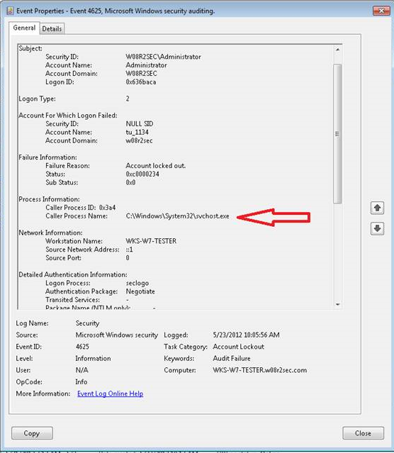

# The name of the process that caused an account lockout does not appear in examination results

Netwrix Account Lockout Examiner relies on the Windows audit system.

The name of the process is logged in the invalid logon event (`4625` in Windows Vista/2008/7/2008R2, events `529-539` in older versions).

**Account Lockout Examiner** will not show the name of the process if either there is no corresponding invalid logon event or the name of the process is not tracked by Windows Audit.

This can occur due to several reasons, for example:

1. Kerberos authentication that takes place before an actual account logon failed, so there is only an invalid Kerberos logon event but no account logon event tracked (the most common).
2. Windows XP invalid logon events (event `529`) do not contain the name of the process that caused this event.
3. Events logged due to entering invalid credentials in an RDP client window normally do not contain the name of the process that caused this event.

There are a lot of other situations when the name of a process can be not logged. The easiest way to make sure that **Account Lockout Examiner** reflects all information correctly is to manually check the invalid logon event in the Security log.
