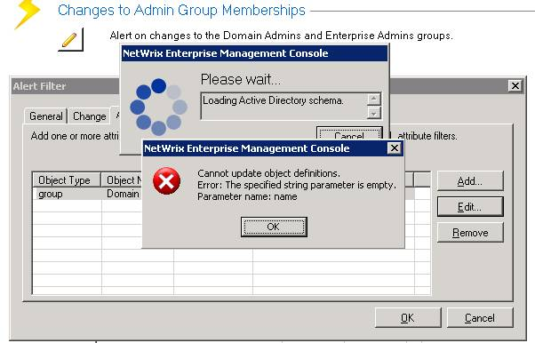

# Unable to create real-time alerts

The first time you create a real-time alert, you see the following errors:

Also in the event viewer System log you can find events like this:

| Product: | Windows Operating System |
|---|---|
| ID: | 10 |
| Source: | Microsoft-Windows-Security-Kerberos |
| Version: | 6.0 |
| Symbolic Name: | KERBEVT_UDP_TIMEOUT |
| Message: | The kerberos subsystem is having problems fetching tickets from your domain controller using the UDP network protocol. This is typically due to network problems. Please contact your system administrator. |

---

By default, Kerberos uses connectionless UDP datagram packets. Depending on a variety of factors including security identifier (SID) history and group membership, some accounts will have larger Kerberos authentication packet sizes. Depending on the network  hardware configuration, these larger packets have to be fragmented when going through a network. The problem is caused by fragmentation of these large UDP Kerberos packets. Because UDP is a connectionless protocol, fragmented UDP packets will be dropped if they arrive at the destination out of order.

---

According to the following [Microsoft TechNet Article](http://technet.microsoft.com/en-us/library/cc733891%28v=ws.10%29.aspx), please force Kerberos to use the TCP instead of the UDP network protocol, because TCP is connection oriented, it is a more reliable means of transport across the network. Even if the packets are dropped, the server will re-request the missing data packet.

To do this, follow these steps:

1. Start Registry Editor.
2. Locate and then click the following registry subkey:  
   `HKEY_LOCAL_MACHINESystemCurrentControlSetControlLsa KerberosParameters`  
   **Note:** If the **Parameters** key does not exist, create it now.
3. On the **Edit** menu, point to **New**, and then click **DWORD Value**.
4. Type `MaxPacketSize`, and then press ENTER.
5. Double-click `MaxPacketSize`, type `1` in the **Value data** box, click to select the **Decimal** option, and then click **OK**.
6. Quit Registry Editor.
7. Restart your computer.
