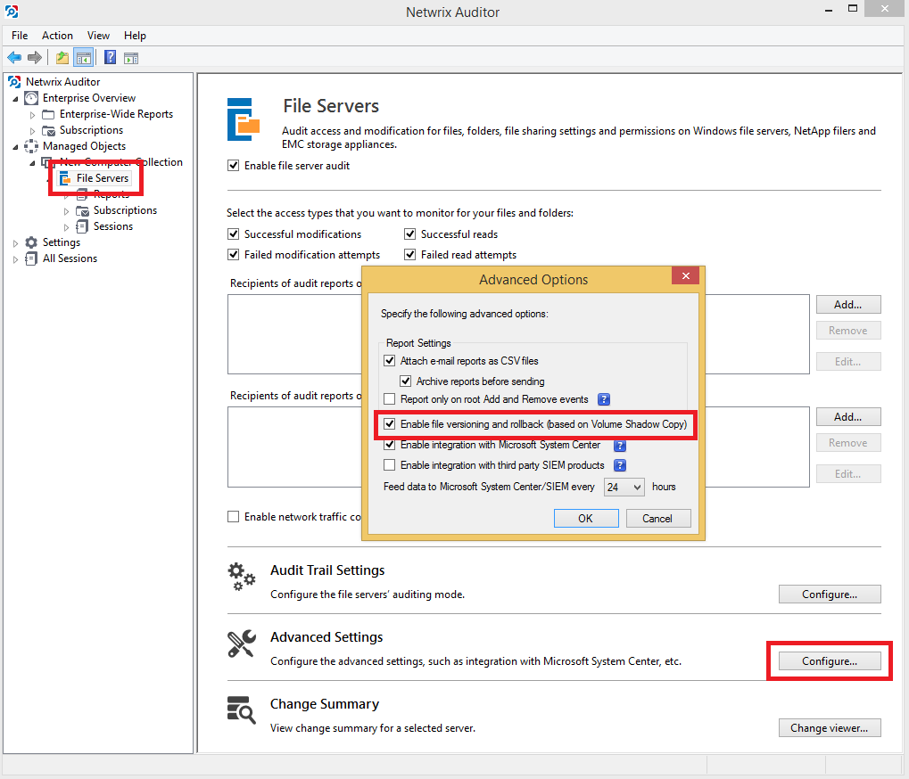

# Volume Shadow Copy Service support in Netwrix Auditor for File Servers

How do you enable the **Volume Shadow Copy Service support** in **Netwrix Auditor**? Where will the **Shadow Copy** data be stored: on an audited file server or on a computer where **Netwrix Auditor** is installed?

## Enable Volume Shadow Copy Service (VSS) support

The **Volume Shadow Copy Service** (hereafter **VSS**) can be enabled via **Netwrix Auditor**. To do it,

1. Navigate to **Managed Objects -> your_File_Servers_Managed_Object_name -> File Servers.**
2. Click **Configure** next to **Advanced Settings** and select the **Enable file versioning and rollback capabilities (based on Volume Shadow Copy).**

## Where Shadow Copy data is stored

The **Shadow Copy** data is stored on the audited file server. **VSS** is a built-in **Windows** service, and when you enable the VSS support, **Netwrix Auditor** just triggers creation of a snapshot. If you have not configured **VSS**, you may want to turn it off (especially if you do not have enough space on that server). To know precisely where the **Shadow Copy** data is stored, refer to the **Shadow Copy** information on the drive volume.
