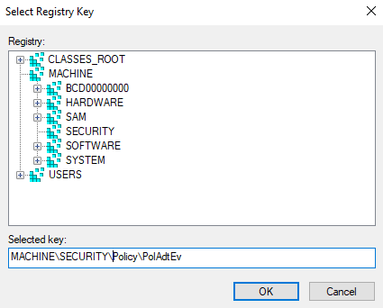

# Why A Registry Key is Missing in Both: GPMC and Local?

## Question

Why a registry key is missing in both: Group Policy Management Console and Local Audit Policies?

## Answer

Registry audit settings are required for some data sources, for example, for Logon Activity Auditing. In some cases, the required registry keys might be missing. Follow the steps below to create the key(s) manually via **Group Policy Management Console**:

1. Open **Group Policy Management Console**.
2. Navigate to **Computer Configuration** -> **Policies** -> **Windows Settings** -> **Security Settings** -> **Registry**.
3. Click **Add key**.
4. Add the key you are trying to add permissions to, then click **OK**.
5. On this screen that pops up, add the required permissions.
6. On the next screen, you’ll be prompted to configure the key, then how you want the settings to be applied; or not allow permission to be replaced.
7. Manually add the path to the Registry Key in the **Selected Key** dialog.  
   

This will apply the key settings to the GPO, and all computers affected by the GPO.
