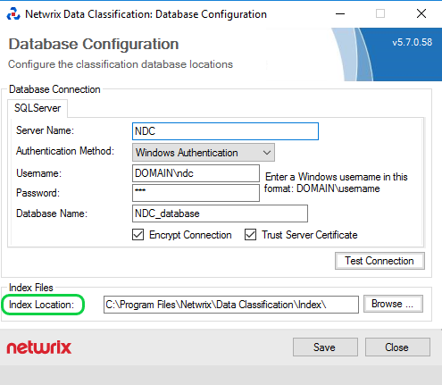

# How to Configure Granular Permissions for a Service Account

## Overview

Granular permissions are needed to reduce the number of accounts with unnecessary administrative rights when implementing the Principle of Least Privilege (POLP). Using granular permissions, you can avoid granting local admin rights to the Netwrix Data Classification Service Account.

## Instructions

To configure granular permissions for a Service Account:

1. Check if your Service Account has the following permissions:
   - Permissions to run the Windows Services and IIS Application pool
   - SQL Server DBO permissions to the Netwrix Data Classification SQL database (if using Windows Authentication to access SQL Server)
   - The Logon as a service privilege

   Read more in the Accounts and Required Permissions article.

2. Add Read permissions to the folder where Netwrix Data Classification is installed (NTFS Permissions).

3. Add Write permissions to the index files' location (NTFS Permissions).  
   The index files' location can be looked up in `conceptConfig.exe` in `C:\inetpub\wwwroot\NDC\bin`:

   

> **TIP:** In some instances, the Netwrix Data Classification Service Viewer Utility won't work correctly if the service account is not a member of the Local Administrators group on the Netwrix Data Classification server. In this case, you should use the **Service Viewer** built into the web UI.
