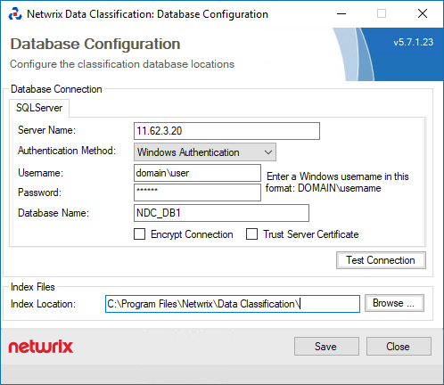

# How to Migrate the Netwrix Data Classification Database

## Question

How can you migrate the Netwrix Data Classification database?

## Answer

> **NOTE:** In Netwrix Data Classification version 5.6 and earlier, refer to the following paths:
>
> ```text
> C:\Program Files\ConceptSearching\Services\ConceptCollectorService\conceptConfig.exe
> C:\inetpub\wwwroot\conceptQS\bin\conceptConfig.exe
> C:\Program Files\ConceptSearching\Services\conceptIndexer\conceptConfig.exe
> C:\inetpub\wwwroot\conceptQS\bin\conceptConfig.exe
> ```

Follow these steps to migrate the Netwrix Data Classification database:

1. Open the **Service Viewer** and stop all three Netwrix Data Classification services. The default path is:

   ```text
   C:\Program Files\Netwrix\Data Classification\ServiceViewer
   ```

   > **NOTE:** In a DQS environment, stop the Netwrix Data Classification services on all Netwrix Data Classification servers.

2. Perform a full Netwrix Data Classification database backup. For details about the backup process, see: [Create a Full Database Backup ⸱ Microsoft](https://learn.microsoft.com/en-us/sql/relational-databases/backup-restore/create-a-full-database-backup-sql-server?view=sql-server-ver16#SSMSProcedure).

3. Restore the Netwrix Data Classification database file from the device to the target SQL Server. For more information, see: [Restore a Database Backup Using SSMS ⸱ Microsoft](https://learn.microsoft.com/en-us/sql/relational-databases/backup-restore/restore-a-database-backup-using-ssms?view=sql-server-ver16#a-restore-a-full-database-backup).

4. Go to the following folder to update the Netwrix Data Classification configuration:

   ```text
   C:\inetpub\wwwroot\NDC\bin\conceptConfig.exe
   ```

   Review the server name and the credentials of the database account. The database name should remain the same unless you changed it during the migration process.

   > **NOTE:** In a DQS environment, apply the changes on each Netwrix Data Classification server in the DQS cluster.

   > **IMPORTANT:** If you are using the Windows Authentication method, verify that the user has the `db_owner` role assigned in the Netwrix Data Classification database. Alternatively, run `conceptConfig.exe` using the service account.

   

5. Open the **Service Viewer** and start all three Netwrix Data Classification services. The default path is:

   ```text
   C:\Program Files\Netwrix\Data Classification\ServiceViewer
   ```

   > **NOTE:** In a DQS environment, start the Netwrix Data Classification services on all Netwrix Data Classification servers.

## Related Articles

- [Create a Full Database Backup ⸱ Microsoft](https://learn.microsoft.com/en-us/sql/relational-databases/backup-restore/create-a-full-database-backup-sql-server?view=sql-server-ver16#SSMSProcedure)
- [Restore a Database Backup Using SSMS ⸱ Microsoft](https://learn.microsoft.com/en-us/sql/relational-databases/backup-restore/restore-a-database-backup-using-ssms?view=sql-server-ver16#a-restore-a-full-database-backup)
