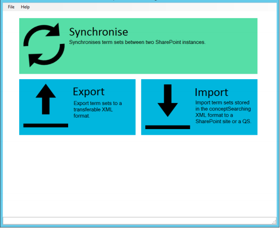
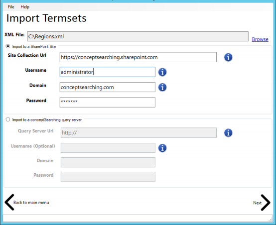
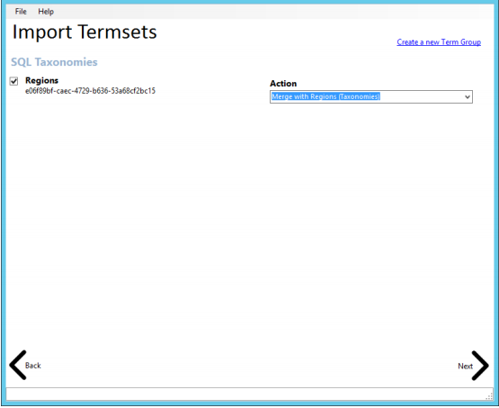
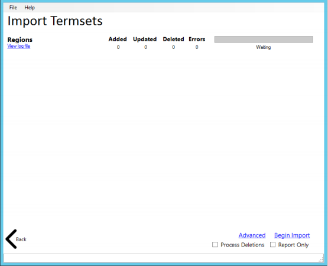

# Import Terms Sets from an XML File using conceptTermStoreManager

Import a term set structure from an XML file via the `conceptTermStoreManager` using the steps listed in this article.

## Procedure

1. Navigate to `C:\inetpub\wwwroot\conceptQS\bin\conceptTermStoreManager.exe`.
2. Run the `conceptTermStoreManager.exe` and observe the following screen:
   
3. Click the **Import** button to import a term set structure from an XML file.
4. Enter the location of the XML file and the destination term store:
   
   - This example uses an Office 365 destination.
5. Click **Next**.
6. Check the boxes of the term sets you wish to import.
7. For each term set, use the drop down list to select a desired **Action**:
   
   - In this example, the **Regions** term set will be merged with the existing term set in the **Taxonomies** term group.
8. Click **Next**.
9. Review the summary on the final page:
   
   - If you wish to ensure terms not found in the source are removed from the destination (`Matching GUID`), check the **Process Deletions** box.
   - If you wish to prevent any changes from occurring in the destination, check the **Report Only** box.
   - Any changes that would have been made to term sets will be logged to the individual term sets logs, which are visible by clicking the **View Log File** link.
   - Optional advanced options can be found by clicking the **Advanced** button.
10. Click **Begin Import**.

Imported term sets will now be available!
