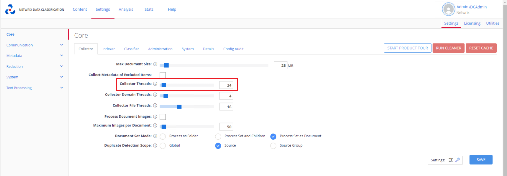

# Netwrix Data Classification Collector, Indexer, and Classifier Threads

## Overview

In this article you will learn how to configure the **Collector Threads** slider in Netwrix Data Classification. The **Collector Threads** slider determines the number of concurrent background processes (threads) that the server can use for data collection tasks. Proper configuration of this setting can optimize performance based on your server's hardware.

## Instructions

### Understanding the Collector Threads Slider

The **Collector Threads** slider allows you to set the number of concurrent threads that Netwrix Data Classification can use. Each thread represents a background process that handles data collection. The optimal number of threads depends on your server's CPU resources.

- **Default value:** **24**. This is suitable for many environments.
- **Recommended value:** Set the number of threads to match your server's capabilities. The general formula is: **Sockets × Processors × 2 = Maximum threads**. For example, a server with 2 sockets and 4 processors (cores) per socket has 8 cores; 8 × 2 = 16 threads.
- **Logical processors:** If Task Manager shows `Logical processors`, use that number as the maximum threads value.
- **Dynamic allocation:** Setting the slider to `0` enables automatic detection. Netwrix Data Classification will dynamically determine the optimal number of threads based on available resources. This is the recommended setting if you are unsure of the best value for your environment.

You can set the Collector Threads value in the **NDC Management Web Console** at `http://localhost/conceptQS/Configuration`.

> **NOTE:** If you notice a decrease in processing capacity, set the **Collector Threads** slider to `0` to enable dynamic allocation.

### Automatic Threading

When the **Collector Threads** slider is set to `0`, Netwrix Data Classification automatically detects the number of available CPU cores and allocates threads accordingly. This ensures optimal use of system resources without manual configuration.

For more information on hardware requirements, see Netwrix Data Classification — Hardware Requirements:
/docs/data-classification/5.7/ndc/requirements

> **NOTE:** After changing the **Collector Threads** value, restart the corresponding service in Windows Services Manager. For example, restart the NDC Indexer service if you change the number of Indexer threads.

## Related Links

- Netwrix Data Classification — Hardware Requirements: /docs/data-classification/5.7/ndc/requirements
