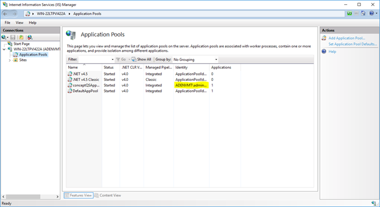

# Service Account Password Reset for Netwrix Data Classification

## Overview

After resetting the service account password for Netwrix Data Classification there are several locations within the product and IIS that you must update to reflect this change. This article shows where you need to supply the new password.

## Services

Update the **Logon As** value for each of the services listed above to reflect the password change.

## ConceptConfig

Navigate to each of the locations below. These locations control the SQL database connection and the account used to make that connection. Update the account credentials for all three locations.

1. `C:\Program Files\ConceptSearching\Services\ConceptCollectorService\conceptConfig.exe`
2. `C:\inetpub\wwwroot\conceptQS\bin\conceptConfig.exe`
3. `C:\Program Files\ConceptSearching\Services\conceptIndexer\conceptConfig.exe`

## IIS

Open IIS and click **Application Pools** on the left-hand pane. Right-click on the **conceptQSAppPool** and click **Advanced Settings**.

Find the **Identity** and update the password to match the new password for the account, then restart the application pool.

## Taxonomy Global Settings

Navigate to `http://hostname/conceptQS/Taxonomies/GlobalSettings` and confirm the status of each taxonomy. Find the faulting termsets and update the credentials for each.
