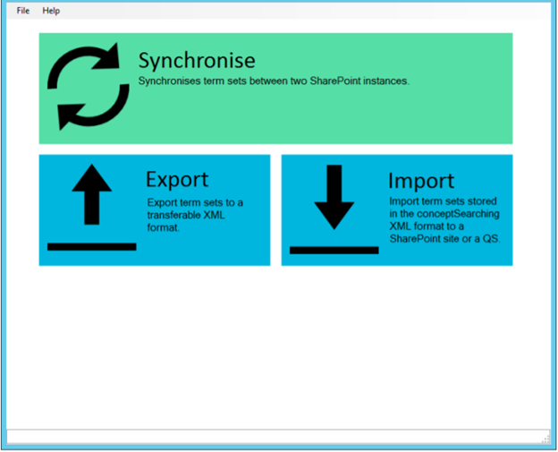
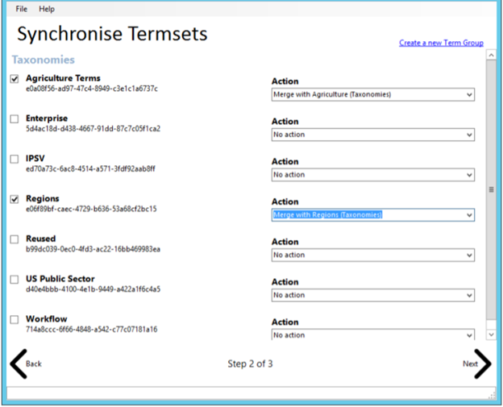
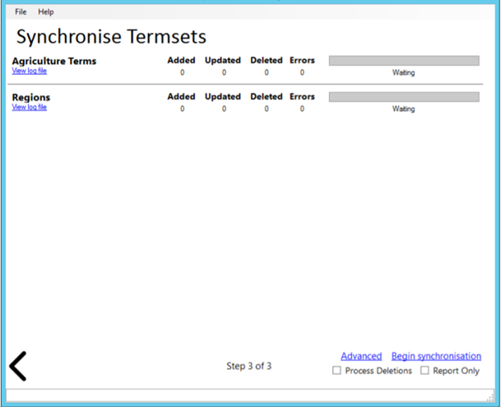

# Synchronizing Term Sets using the conceptTermStorageManager

Synchronize term set structures between two SharePoint instances via the conceptTermStoreManager using the steps listed in this article

---

## Procedure

1. Navigate to `C:\inetpub\wwwroot\conceptQS\bin\conceptTermStoreManager.exe`
2. Run the `conceptTermStoreManager.exe` and observe the following screen:
   - 
3. Click the **Synchronise** box
4. Enter the **Source SharePoint farm** and **Destination SharePoint farm** URLs
5. Provide credentials that have access to the Term Store
6. Click **Next**
7. Check the boxes for each desired term set
8. Use the drop down box to select an action
   - 
   - In this example, the **Regions** term set will be merged into the existing term sets in the **Taxonomies** term group
9. Click **Next**
10. Review the summary on the final page
    - 
    - If you wish to ensure terms not found in the source are removed from the destination (Matching GUID), check the **Process Deletions** box
    - If you wish to prevent any changes from occurring in the destination, check the **Report Only** box
    - Any changes that would have been made to term sets will be logged to the individual term sets logs, which are visible by clicking the **View Log File** link.
    - Optional advanced options can be found by clicking the **Advanced** button.
11. Click **Begin Synchronisation**
