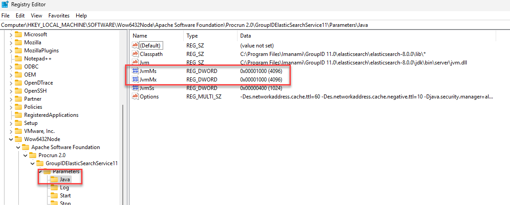

# Adjust Heap Size for Elasticsearch Service

## Applies To
Netwrix Directory Manager 11.1

## Overview
This article explains how to increase the Java heap size for the Elasticsearch service in Netwrix Directory Manager v11.1. Adjusting the heap size can improve search performance and help prevent memory-related issues.

Elasticsearch relies on allocated heap memory for storing and processing data. If the heap size is too small, it can cause performance degradation or service instability. Allocating too much memory can also negatively affect system resources.

Heap size settings are defined in the registry and control the minimum and maximum memory allocated to Elasticsearch:

- `-Xms`: Initial heap size
- `-Xmx`: Maximum heap size

It is recommended to set both values to the same amount to maintain performance consistency.

## Instructions
1. Open the **Registry Editor** on the server running Elasticsearch.
2. Navigate to the following registry path:  
   `HKEY_LOCAL_MACHINE\SOFTWARE\Wow6432Node\Apache Software Foundation\Procrun 2.0\GroupIDElasticSearchService11\Parameters\Java`
3. Locate the parameters for heap size:
   - `-Xms` (Initial heap size)
   - `-Xmx` (Maximum heap size)
4. Modify both values as needed. For example, to allocate 4 GB of memory:
   - `-Xms4g`
   - `-Xmx4g`

   > **NOTE:** Make sure both `Xms` and `Xmx` values are the same.

5. 
6. Close the **Registry Editor** after saving the changes.
7. Restart the **GroupIDElasticSearchService11** service for the changes to take effect.

> **NOTE:** To restart the service, open **Services** (`services.msc`), locate **GroupIDElasticSearchService11**, right-click it, and select **Restart**.
