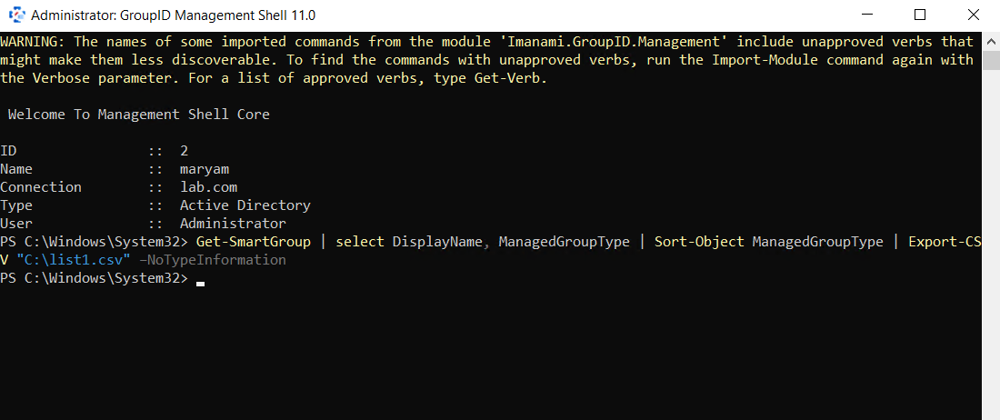
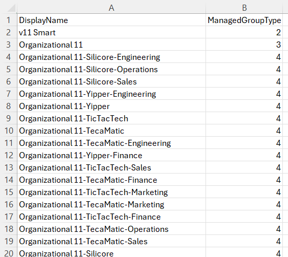

# Bulk Export and Sort All Smart Groups and Dynasties

## Applies To
Netwrix Directory Manager 11

## Overview
This article explains how you can export all managed groups and Dynasties from Netwrix Directory Manager to a CSV file and sort them by group type using the **Directory Manager Management Shell**. This process is useful for analyzing and managing large numbers of groups in your directory.

The `ManagedGroupType` attribute identifies the type of each group and returns the following values:

- `1` = Non-managed group
- `2` = Smart Group
- `3` = Parent Dynasty
- `4` = Middle Dynasty
- `5` = Leaf Dynasty
- `6` = Password Expiry SmartGroup

## Instructions
1. Launch the **Directory Manager Management Shell**.
2. Log in to the Management Shell with your service account.
3. Run the following cmdlet to retrieve Smart Groups and Dynasties, sort them by `ManagedGroupType`, and export them to a CSV file:

```powershell
Get-SmartGroup | select DisplayName, ManagedGroupType | Sort-Object ManagedGroupType | Export-CSV "C:\list.csv" –NoTypeInformation
```

4. The above cmdlet will:
   - Retrieve all managed groups using `Get-SmartGroup`.
   - Select the `DisplayName` and `ManagedGroupType` attributes.
   - Sort the results in ascending order based on the `ManagedGroupType` attribute.
   - Export the sorted list to a CSV file named **list.csv** at `C:\list.csv`.

> **NOTE:** You can change the export directory by updating the file path in the cmdlet (for example, `D:\exports\list.csv`).




5. To retrieve additional details, you can append more attributes to the cmdlet. Example attributes include:
   - `smartGroupType`
   - `expiration`
   - `managedBy`
   - `whenCreated`
   - `UPN`
   - `criteria`
   - `SearchContainer`
   - `SearchContainersScopeList`
   - `Identity`
   - `ShouldReturnCollection`
   - `MaxItemsToDisplay`
   - `ObjectType`
   - `LdapFilter`
   - `SmartFilter`
