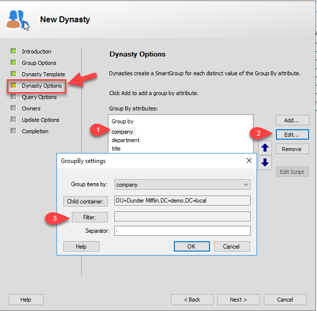
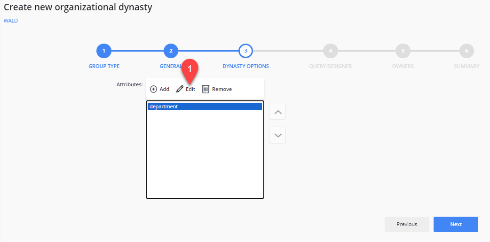
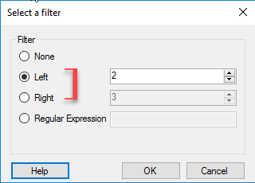
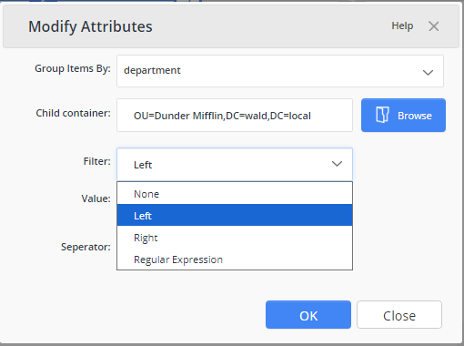
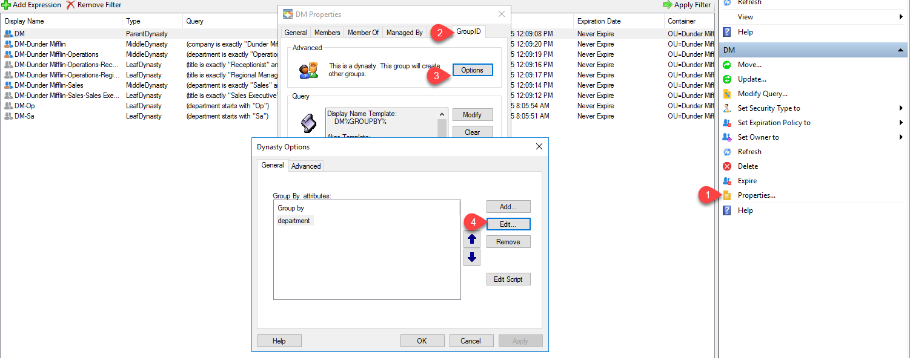
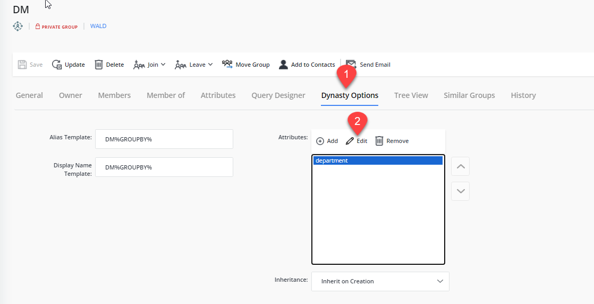

# Change the Default Dynasty Operator

## Applies To

Netwrix Directory Manager 10 Automate and Netwrix Directory Manager 11 Group Management

## Overview

In some organizations, the **Title** field may include multiple abbreviations (such as A1, B2, or C1) or a full job title with tiers (such as Systems and Network Engineer). In these cases, using the default **Is Exactly** operator when creating Dynasties may not produce the desired group structure.

Instead, you can use the **Starts with** or **Ends with** operator to better match partial title values and group users accordingly.

### Example: Using a Custom Attribute

If the **Title** and **Tier** are separated—such as placing the title in **Custom Attribute 1**—you can group by that attribute to simplify results.

**Attribute value:** `Custom Attribute 1 = SOC Analyst`

**Sample group created:** Everyone who is SOC Analyst

### Example: Using the Full Title Field

If the **Title** field includes both the title and tier (e.g., SOC Analyst I, SOC Analyst II), Netwrix Directory Manager will create a group for each unique value.

**Attribute values:**
- **Title** = `SOC Analyst I`
- **Title** = `SOC Analyst II`

**Sample groups created:**
- Everyone who is SOC Analyst I
- Everyone who is SOC Analyst II

To avoid excessive group creation, use the **Group-By** filter to focus only on the desired portion of the value—for example, everyone who is **SOC Analyst**.

## Instructions

You can update the default Dynasty grouping behavior when creating a new Dynasty or editing an existing parent Dynasty. Follow the steps below based on your scenario.

### Creating a New Dynasty

1. When creating a new Dynasty, continue through the wizard until you reach the **Dynasty Options** window.
2. Select the attribute you want to group by and click **Edit**. In the **GroupBy settings** dialog, click **Filter**.

   

   

3. To change the default operator, choose **Left** and enter the desired number of characters if using **Starts with**. Choose **Right** to switch to **Ends with**.

   

   

4. After saving your changes, the Dynasty will reflect the updated grouping behavior.

### Editing an Existing Dynasty

1. To configure an existing Dynasty using the same filter method, open the parent Dynasty’s properties.
2. Navigate to the **Netwrix Directory Manager** tab and click **Options**.
3. Follow steps 2 and 3 in the **Creating a New Dynasty** section above to configure and apply the GroupBy filter.

   

   

4. After saving your changes, the Dynasty will reflect the updated grouping behavior.

   
