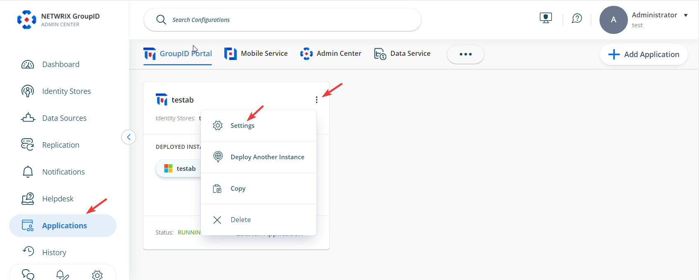
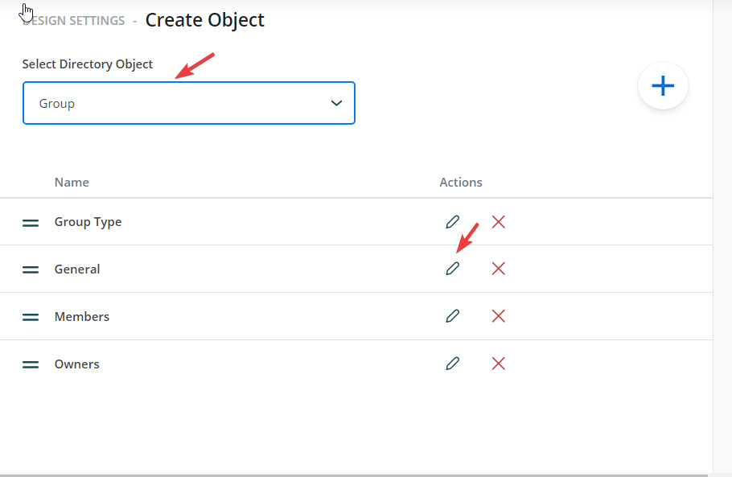
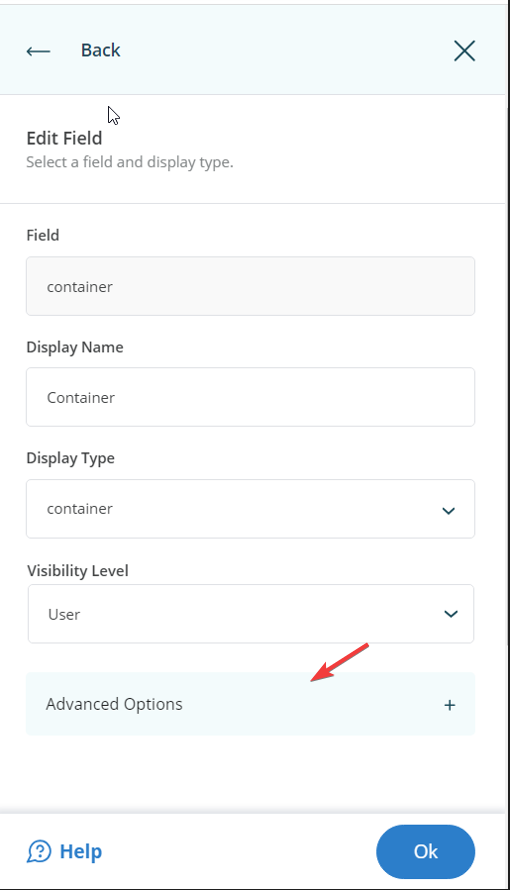
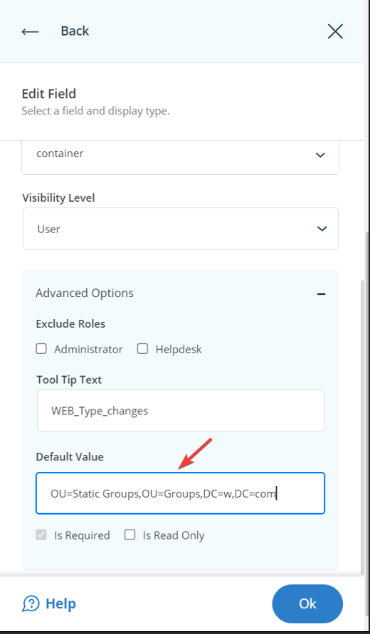
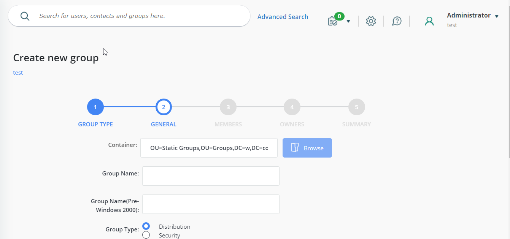
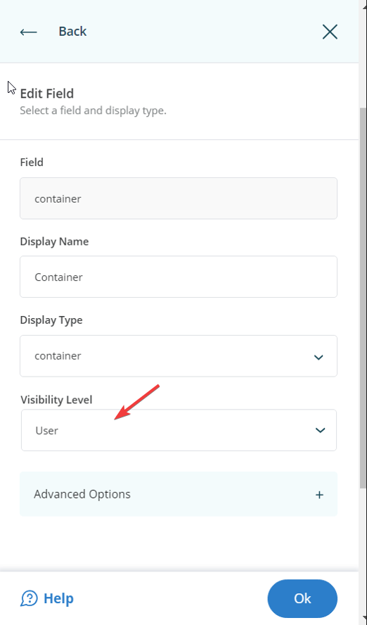
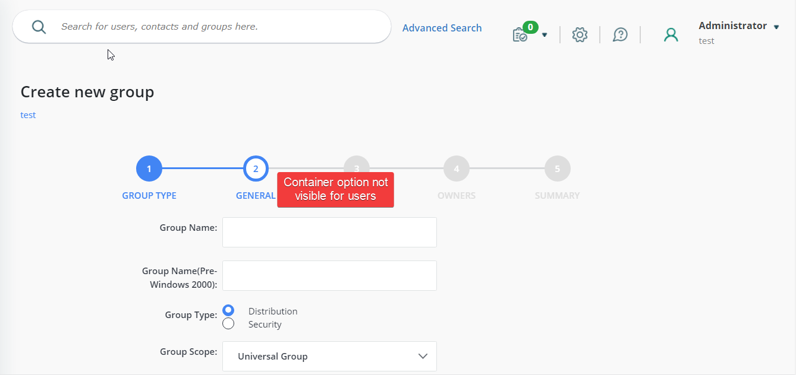

# Configure a Default Container for Creating New Objects

## Applies To

Directory Manager 11

## Overview

Netwrix Directory Manager (formerly GroupID) allows administrators to configure a default container for creating new objects, such as groups, users, contacts, and mailboxes. You can control whether users can select a different container, enforce the default container, or hide the container selection entirely. This flexibility helps ensure that new objects are created in the correct location according to your organization's policies.

## Instructions

### Access Portal Design Settings

1. In the **Directory Manager Admin Center**, select **Applications**.
2. Under **Directory Manager Portal**, select the three-dot icon for your portal and click **Settings**.

   

3. On the **Server Settings** tab, under **Design Settings**, select your portal.

   

4. Click the **Create Object** tab to customize the Object Creation wizard.
5. In the **Select Directory Object** drop-down list, select the object type for which you want to set a default container (for example, *Group*).
6. In the **Name** list, select **General** and click **Edit**.

   

7. In the **Edit Category** dialog box, select **Container** in the **Fields** area and click **Edit**.

   

8. In the **Edit Field** dialog box, click **Advanced options**.

   

### Configure Default Container Options

1. Specify a default container while allowing users to change it.
2. In the **Default Value** box, enter the distinguished name of the container you want to set as default.
3. Click **OK** and **Save** your changes.

   

   Expected Result: On the **Create Group** wizard in the User portal, the specified container is selected by default, but users can click **Browse** to select another container.

   

### Enforce a Default Container and Disable Container Selection

1. In the **Edit Field** dialog box, specify a default container and select the **Is Read Only** check box.
2. Click **OK** and **Save** your changes.

   

   Expected Result: On the **Create Group** wizard, the specified container is displayed as the default, and the **Container** field is disabled. Users can only create new groups in the default container.

   

### Enforce a Default Container and Hide Container Selection

1. In the **Edit Field** dialog box, use the **Visibility Role** option to select which user roles can see the **Container** field. Only the selected role and roles with a higher priority value will see the field. All roles with a lower priority value will not see or change the default container.
2. Click **OK** to save your changes.

   

   Expected Result: On the **Create Group** wizard in the Self-Service portal, the **Container** field is hidden, and users create groups without knowing the container being used.

   

> **NOTE:** If you hide the **Container** field for any role, you must provide a default value for this field. Otherwise, those roles will not be able to create groups.