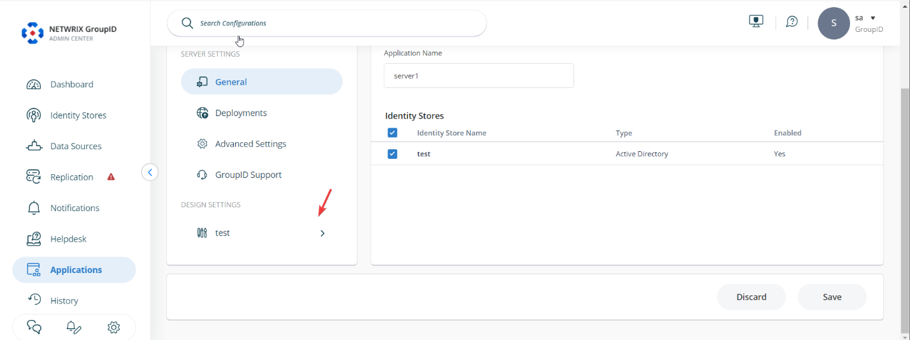
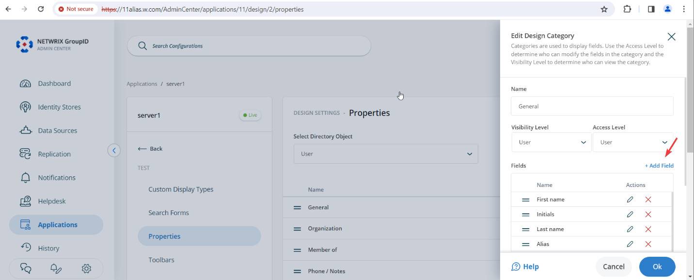
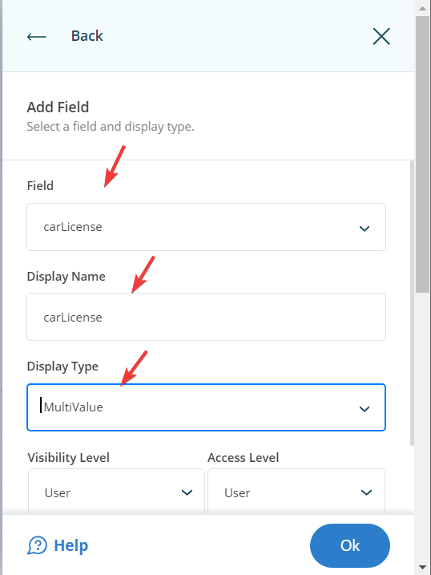
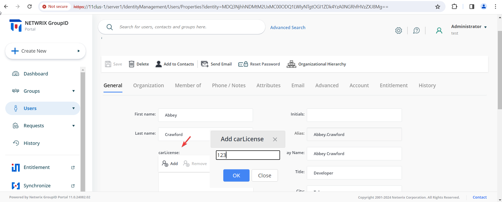
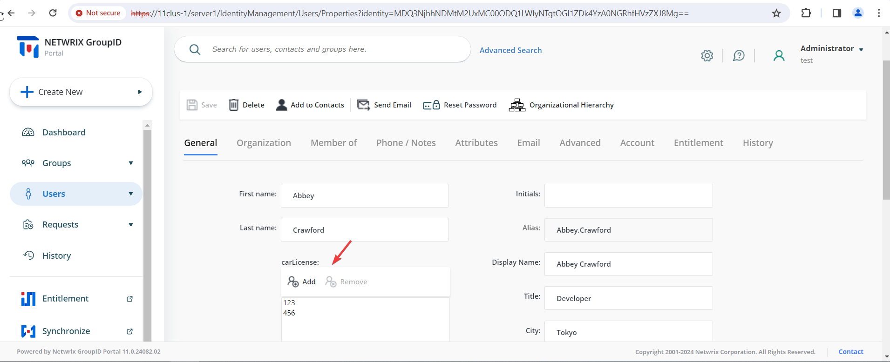

# Configure Multi-Valued Attributes in the Self-Service Portal

## Applies To

Directory Manager 11

## Overview

This article explains how to configure the Self-Service portal in Netwrix Directory Manager (formerly GroupID) to support multi-valued attributes, using `carLicense` as an example.

Multi-valued attributes in Active Directory, such as `carLicense` or phone numbers, allow users to store multiple unique values in a single field. In contrast, single-valued attributes, such as names, can hold only one value. Active Directory does not create attributes with empty values, and each value in a multi-valued attribute must be unique.

## Instructions

1. In the Directory Manager Admin Center, go to **Applications**. On the application or portal where you want to add the attribute, click the three-dot icon and select **Settings**.

   

2. Under **Design Settings**, expand your identity store’s name.

   

3. On the **Properties** tab, select *User* from the **Select Directory Object** list.
4. Select **General** in the **Name** list and click the edit symbol under **Actions**.

   

5. On the **Edit Design Category** page, click **Add Field**.

   

6. Select the **carLicense** attribute in the **Field** list, enter the display name as *carLicense*, and set the display type to *MultiValue*.

   

7. Click **OK**. Scroll down and click **Save**.
8. Launch the user portal. The **carLicense** multi-valued box appears on the General tab in user properties.
9. To add a license number, click **Add**, enter the license number, and click **OK**. You can add multiple license numbers to this field.

   

10. View the license numbers added to the user's profile.

    