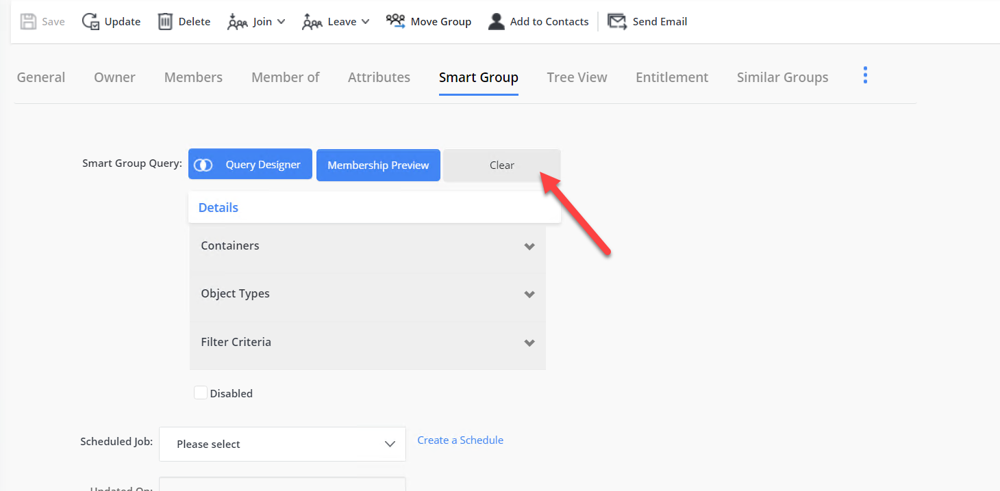
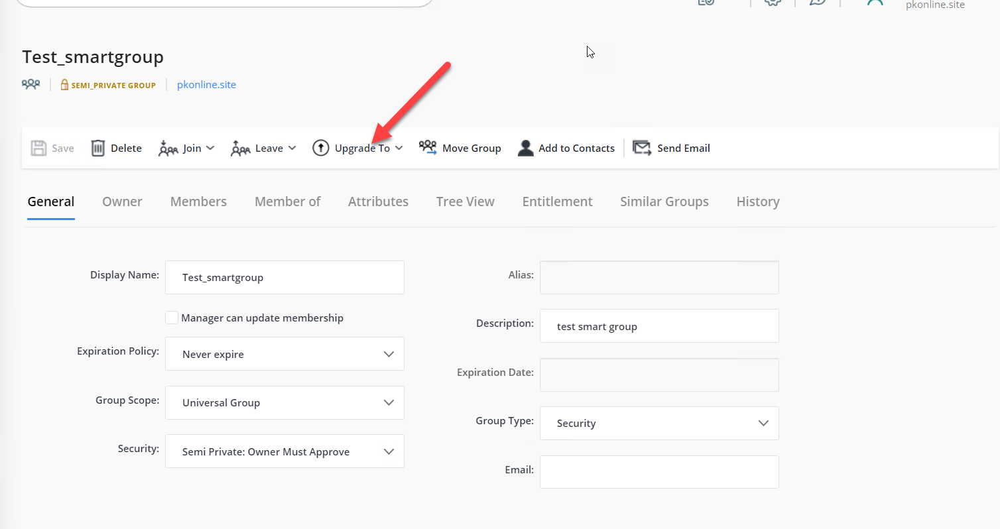

# Convert Between Smart Groups and Static Groups

## Applies To
Netwrix Directory Manager 11

## Overview
In Netwrix Directory Manager, you can convert a Smart Group to a static group by clearing its LDAP query or convert a static group to a Smart Group by applying an LDAP query in the application portal. This functionality enables flexible management of group types based on organizational requirements.

## Instructions

### Convert a Smart Group to a Static Group
1. Log in to the application portal of Netwrix Directory Manager.
2. Open the properties of the Smart Group you want to convert to a static group.
3. On the properties page, navigate to the **Smart Group** tab.
4. Click the **Clear** button next to the Smart Group query.
5. When prompted, click **Clear query text** to confirm. The group will be converted to a static group, and the current membership will remain unchanged.

### Convert a Static Group to a Smart Group
1. Log in to the application portal of Netwrix Directory Manager.
2. Open the properties of the static group you want to convert to a Smart Group.
3. On the properties page, click the **Upgrade to** button. Two options will populate, select **Smart Group**.
4. When prompted, confirm the action. The query designer will open, allowing you to specify the LDAP query as required.
5. After confirming the query, the group will be converted to a Smart Group.

