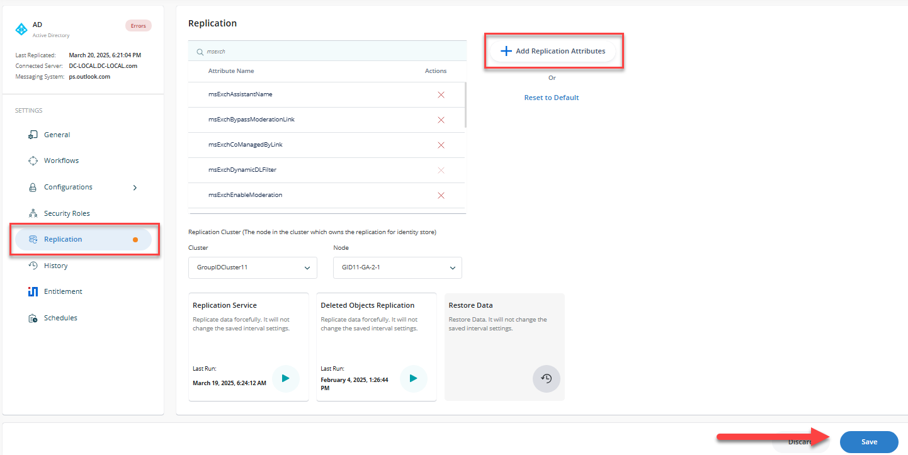
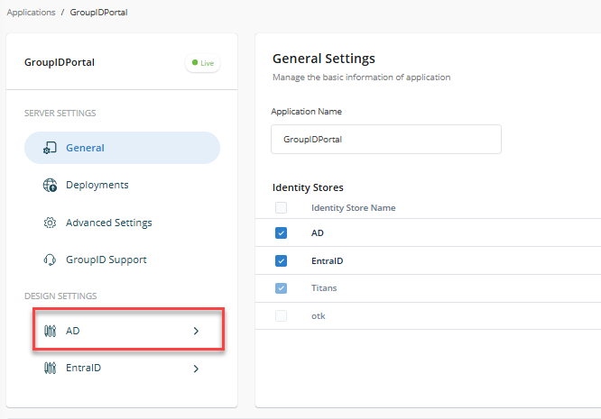
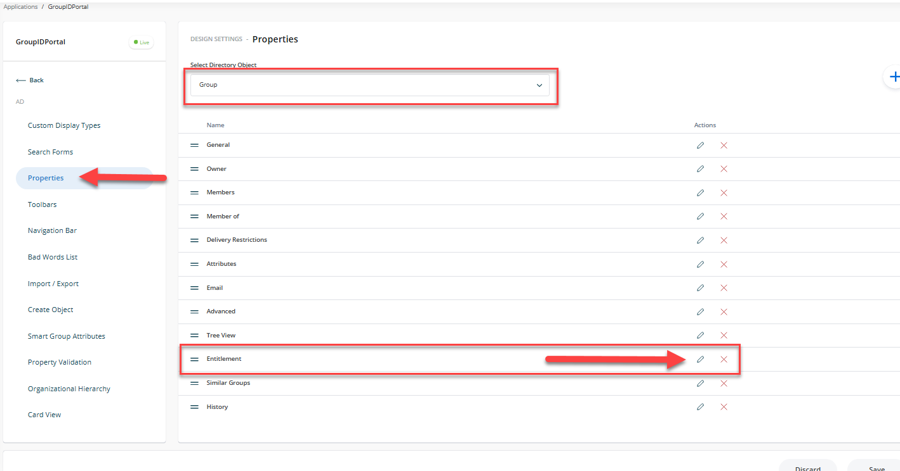
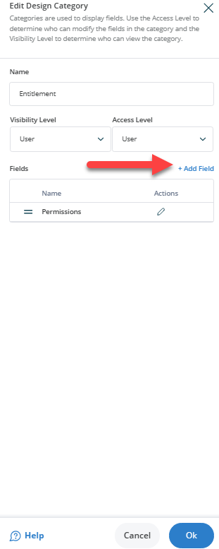
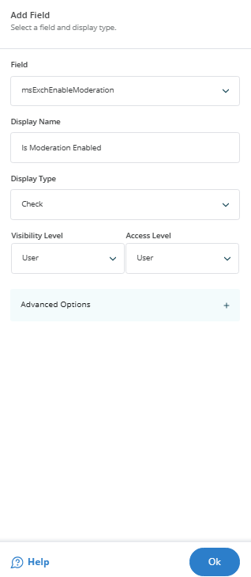
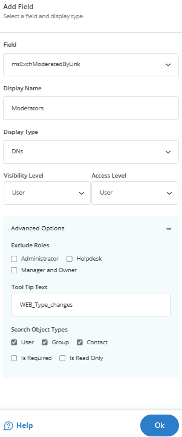
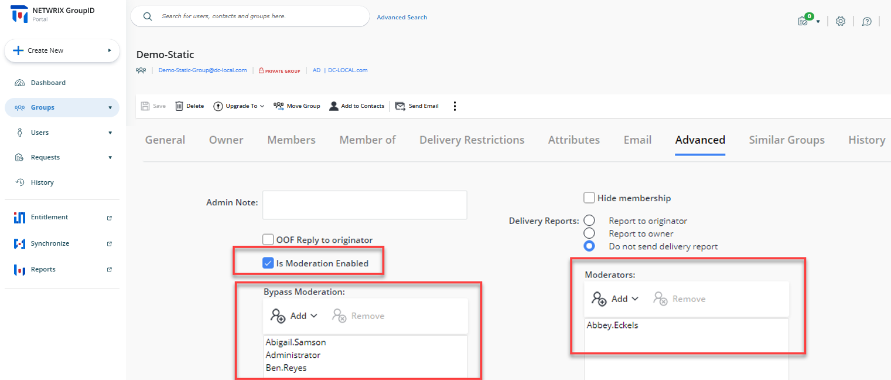

# Displaying Moderators for Exchange Distribution Li

## Applies To

Netwrix Directory Manager 11 or above

## Overview

This article outlines the process of modifying the Netwrix Directory Manager portal to show moderator settings for distribution lists configured in Microsoft Exchange, using specific Active Directory attributes.

The following attributes are associated with message moderation for on-premise Microsoft Exchange:

- `msExchEnableModeration`: Enables or disables message moderation for a distribution group. When enabled, messages sent to the group require moderator approval before delivery.
- `msExchModeratedByLink`: Associates a moderated recipient with a distribution list or security group whose members serve as moderators.
- `msExchBypassModerationLink`: Associates a moderated recipient with a distribution list or security group whose members are allowed to bypass message moderation.

By utilizing these attributes, you can create a customized view in the Netwrix Directory Manager Portal to display the appropriate message approvers for distribution lists. This customization helps you manage message moderation effectively within your organization's Exchange environment.

## Instructions

Follow the instructions below to configure the Netwrix Directory Manager Portal:

1. Open the **Identity Stores** tab in the **Netwrix Directory Manager Admin Center** and click **Edit** under the ellipses menu on the appropriate Identity Store card.

2. On the **Replication** tab, click **Add Replication Attributes** and add the required attributes.

   

3. Click **Settings**. A new page will appear.

   

4. Select the appropriate **Identity Store**.

   

5. Under the **Properties** tab, select **Group** from the **Select Directory Object** list.

6. Select **Advanced** in the **Name** list and click the **Pencil** icon.

   

7. On the Edit Design Category dialog box, click **Add Field**.

   

8. Select `mxExchEnableModeration` from the **Field** list, enter the display name as **Is Moderation Enabled** and set the display type to **Check**.

9. Click **OK** and then click **Add Fields** again.

   

10. Select `mxExchModeratedByLink`, enter the display name as **Moderators**, and set the display type to **DNs**.

11. Click **OK** and then click **Add Fields** again.

   

12. Select `mxExchBypassModerationLink`, enter the display name as **Bypass Moderation**, and set the display type to **DNs**.

13. Click **OK** and then click the **Save** icon at the top of the page.

   

14. Launch the **Netwrix Directory Manager Portal**. The new attributes should appear under the **Groups** tab under **Advanced**.

   
