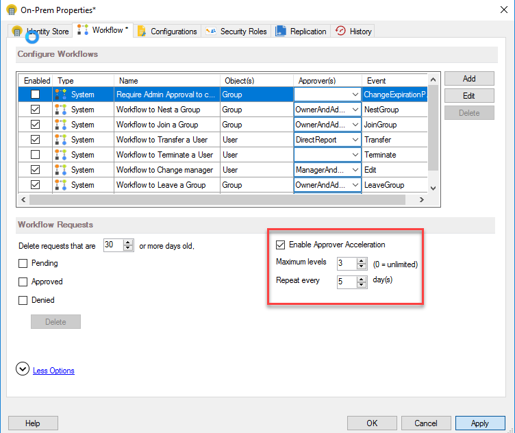

# Enable and Configure Workflow Approver Acceleration

## Applies To
Netwrix Directory Manager 10 and 11

## Overview
Netwrix Directory Manager workflows provide oversight and control for changes made to directory data, such as Active Directory. When a user initiates an action—like creating a group—a workflow request is generated and requires approval before proceeding. If the assigned approver is unavailable, requests can accumulate and delay business operations.

To address this, Netwrix Directory Manager includes workflow approver acceleration. This feature automatically escalates pending requests to the next approver after a specified number of days, ensuring that no request remains unaddressed. Administrators can also review and act on any workflow request at any time from the **All Requests** node in the Netwrix Directory Manager Management Console.

## Instructions

### Enable Workflow Approver Acceleration for an Identity Store in Netwrix Directory Manager 10
1. In the Netwrix Directory Manager Management Console, click the **Identity Stores** node.
2. On the **Identity Stores** tab, double-click an identity store to open its properties.
3. On the **Workflow** tab, click the **Advanced Options** link.  
   
4. Select the **Enable Approver Acceleration** checkbox to apply the settings and rules to all workflow routes defined for the identity store.  
   
5. To disable approver acceleration for a route, see the "Disable Approver Acceleration for a Workflow Route" section.
6. In the **Maximum Levels** box, specify the maximum number of escalation levels (for example, `2`). Requests not approved or denied at the maximum level are routed to the default approver, as specified in group life cycle settings for the identity store.
7. In the **Repeat every days** box, specify the number of days (for example, `5`). If an approver does not act within this period, the request is escalated to the next approver in the chain.
8. Click **OK** to save your changes.

### Enable Workflow Approver Acceleration for an Identity Store in Netwrix Directory Manager 11
1. Log in to the Netwrix Directory Manager Admin Center, click the **Identity Stores** tab, and then edit the required identity store.  
   
2. From the Settings pane, select **Workflows**, then select **Advanced Workflow Settings** on the card menu on the right.  
   
3. Toggle **Approver Acceleration** and configure the options as needed. Click **Save** at the bottom right of the screen.

> **NOTE:** Approver acceleration requires that an SMTP server is configured for the identity store.

For example, if User A (the approver) does not act on a request within the specified number of days, the request is escalated to User B (first escalation level). If User B does not act, it escalates to User C (second level), and so on, up to the maximum level. If still not approved or denied, the request is routed to the default approver.

### Disable Approver Acceleration for a Workflow Route
Workflow approver acceleration settings apply to all workflow routes in an identity store, but you can disable it for individual routes.

Follow the steps below for Netwrix Directory Manager 10:
1. In the Netwrix Directory Manager Management Console, click the **Identity Stores** node.
2. On the **Identity Stores** tab, double-click an identity store to open its properties.
3. On the **Workflow** tab, select a workflow to disable approver acceleration for, and click **Edit**.
4. In the **Workflow Route** dialog box, select the **Disable approver acceleration** checkbox to exempt this workflow route from approver acceleration.

Follow the steps below for Netwrix Directory Manager 11:
1. Log in to the Netwrix Directory Manager Admin Center, then navigate to the **Identity Stores** tab from the navigation pane.
2. Click the options (three dots) for the required identity store and select **Edit**.
3. Click **Workflows** from the Settings tab. In the list of workflows, click the options (three dots) for the workflow you want to update, then select **Edit**.  
   
4. Clear the **Approver Acceleration** option and click **Update Workflow**. Then scroll down and click **Save**.
5. This will exempt the workflow from approver acceleration.

### Workflow Approver Acceleration Rules
If an approver does not act on a workflow request within the specified number of days, Netwrix Directory Manager applies the following rules to escalate the request:
- If the approver is a user and does not act, the request is escalated to the user’s primary manager. This continues up to the maximum escalation level.
- After the last escalation level, if the request is still not acted upon, it is escalated to the default approver (as specified in group life cycle settings).
- If the default approver does not act, the request remains in the system as static.
- If a group is an approver and no group member acts, the request is escalated to the group’s primary owner.

### Workflow Acceleration Job
A scheduled job, **Workflow Acceleration**, is predefined in Netwrix Directory Manager for each identity store. By default, this job runs daily to escalate workflow requests according to the acceleration settings and rules. It also generates notifications to inform approvers about pending workflow requests.
