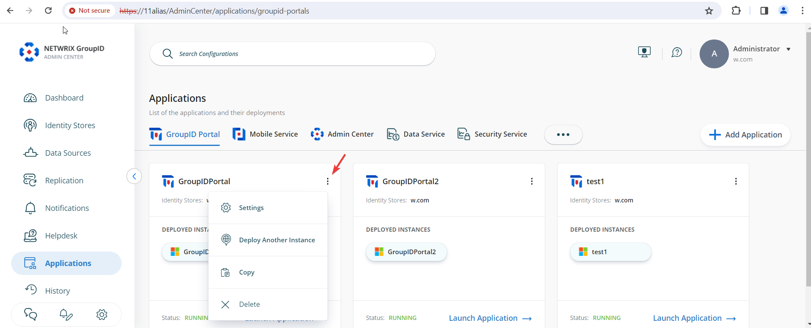
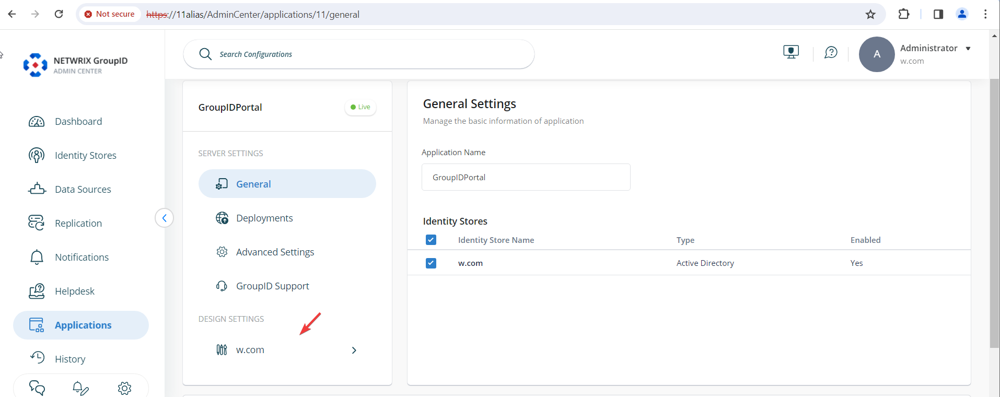
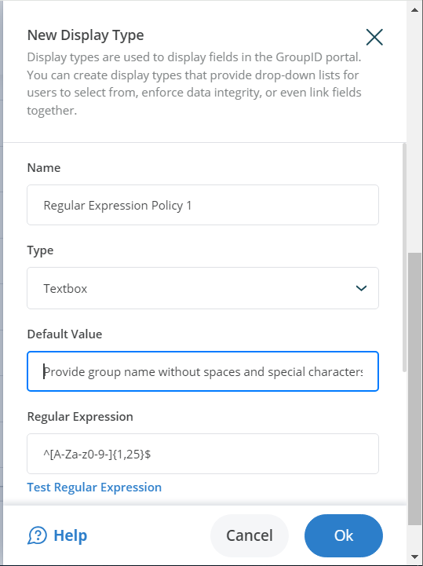
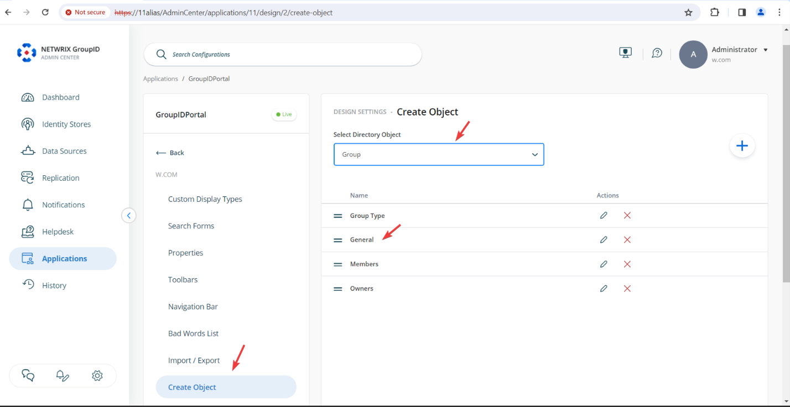
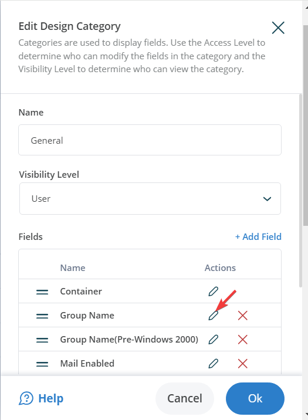
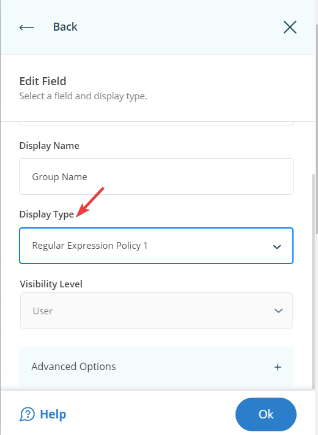

# Enforce Group Naming Convention and Input Validation with Regular Expressions

## Overview

This article explains how to enforce group naming conventions and input validation in Netwrix Directory Manager (formerly GroupID) by using regular expressions. Administrators can define naming policies for groups created through the User portal by configuring regular expressions for input fields.

Enforcing naming standards is especially important when users have access to Active Directory via the User portal. The process involves two main steps:

- [Create a display type](#create-display-type)
- [Associate the display type with the desired field](#associate-display-type)

## Instructions

### Create a Display Type

1. In the **Directory Manager Admin Panel**, select **Applications**. Click the three-dot icon on the desired portal/application and select **Settings**.

   

2. Under **Design Settings**, select your identity store’s name to expand it.

   

3. Select **Custom Display Types** and click **Add**.

   

4. On the **New Display Type** page, enter a name for the display type in the **Name** box (for example, **Regular Expression Policy 1**). From the **Type** list, select **Textbox** and click **OK**. Complete the other options as described below:

   | **Field**            | **Description**                                                                                     |
   |----------------------|-----------------------------------------------------------------------------------------------------|
   | *Default Value*      | Specify a default value to display in the textbox.                                                |
   | *Regular Expression* | Enter a regular expression to validate the data entered in the textbox.                           |
   | *Error Message*      | Enter the error message to display when the input does not match the regular expression.          |

   

5. Click **OK** and then **Save** to save your changes. The new display type appears under **Custom Display Types**.

### Associate the Display Type with a Field

1. In the **Directory Manager Admin Panel**, select **Applications**. Click the three-dot icon on the desired portal/application and select **Settings**.
2. Under **Design Settings**, select your identity store’s name to expand it.
3. Scroll down and click **Create Object**. Under **Select Directory Object**, select **Group** from the drop-down list.
4. In the **Name** list, select **General** and click **Edit**.

   

5. On the **Edit Design Category** page, select **Group name** in the **Fields** area and click **Edit**.

   

6. On the **Edit Field** page, select the display type you created (for example, *Regular Expression Policy 1*) from the **Display Type** drop-down list.

   

7. Click **OK** twice to close the dialog boxes, then scroll down and click **Save** to apply the changes. The display type is now linked to the **Group name** field in the **Create Group** wizard.

## Result

The naming convention defined by the regular expression ensures that group names meet your requirements. For example, if the policy allows only alphabetic characters, the portal will reject names with spaces or special characters and display the specified error message.


### Regular Expression Examples

- **Example 1:** Allow only alphabetic characters (A–Z, a–z) and digits (0–9), with a length of 1 to 25 characters.  
  ```plaintext
  ^[A-Za-z0-9-]{1,25}$
  ```

- **Example 2:** Allow alphabetic characters, digits, underscores (_), hyphens (-), asterisks (*), commas (,), and spaces, with a length of 1 to 30 characters.  
  ```plaintext
  ^[A-Za-z0-9-,_*\s]{1,30}$
  ```

- **Example 3:** Enforce North American phone number format: (555) 123-4567.  
  ```plaintext
  ^\ (\d\d\d\) \d\d\d-\d\d\d\d$
  ```

- **Example 4:** Accept telephone numbers in the format: 1 555 555 5555.
  ```plaintext
  ^[01]?[- .]?(\([2-9]\d{2}\)|[2-9]\d{2})[- .]?\d{3}[- .]?\d{4}$
  ```