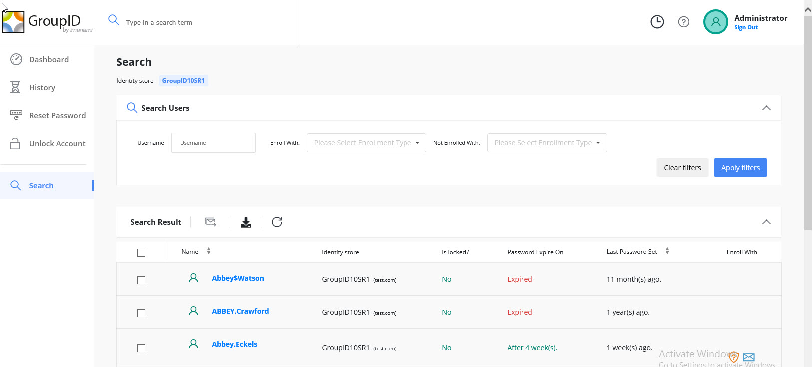

# Export Enrolled User Reports with Additional Fields

## Applies To
Netwrix Directory Manager 10

## Overview
By default, the Netwrix Directory Manager (formerly GroupID) Password Center Help Desk Portal allows you to export a report of enrolled users with the following fields:

- Display Name
- Identity Store
- Locked
- Last Password Set
- Password Expires On
- Enrolled With



However, you cannot add additional fields to the exported file using the Password Center interface, as the design node is not available in the MMC for design changes. As a workaround, you can use the Netwrix Directory Manager management shell to export user data with additional fields such as `SamAccountName` and `Email Address`.

## Instructions

### Export Enrolled User Data with Additional Fields
1. Open the **Directory Manager Management Shell** and run it as an administrator.
2. Import the Active Directory module by running the following command:
   ```
   import-module ActiveDirectory
   ```
3. To export all users with additional fields, run the command below. This will include fields such as `SamAccountName`, `DisplayName`, `PasswordLastSet`, `Mail`, `UserPrincipalName`, `ObjectGUID`, and `LockedOut`, and will export the results to a CSV file:
   ```powershell
   $a = Get-ADUser -Filter * -Properties Mail, SamAccountName, PasswordLastSet, UserPrincipalName, DisplayName, LockedOut, ObjectGUID | 
       Select-Object SamAccountName, UserPrincipalName, DisplayName, Mail, PasswordLastSet, LockedOut, ObjectGUID

   $results = foreach ($user in $a) {
       # Retrieve enrollment info
       $enrollment = Get-UserEnrollment -Identity $user.SamAccountName

       # Convert the array to a comma-separated string
       $enrollmentString = $enrollment -join ', '  # Join array elements with a comma and space

       [PSCustomObject]@{
           DisplayName      = $user.DisplayName
           SamAccountName   = $user.SamAccountName
           EmailAddress     = $user.mail
           UserPrincipalName= $user.UserPrincipalName
           ObjectGuid       = $user.ObjectGuid
           PasswordLastSet  = $user.PasswordLastSet
           LockedOut        = $user.LockedOut
           EnrollmentInfo   = $enrollmentString
       }
   }
   $results | Export-Csv -Path c:\UsersEnrollmentReport.csv -NoTypeInformation
   ```
4. To run the export for a single user, run the command below. Replace ` "enter the name of the user" ` with the actual username:
   ```powershell
   $a = Get-ADUser -Identity "enter the name of the user" -Properties Mail, SamAccountName, PasswordLastSet, UserPrincipalName, DisplayName, LockedOut, ObjectGUID | 
       Select-Object SamAccountName, UserPrincipalName, DisplayName, Mail, PasswordLastSet, LockedOut, ObjectGUID

   $results = foreach ($user in $a) {
       # Retrieve enrollment info
       $enrollment = Get-UserEnrollment -Identity $user.SamAccountName

       # Convert the array to a comma-separated string
       $enrollmentString = $enrollment -join ', '  # Join array elements with a comma and space

       [PSCustomObject]@{
           DisplayName      = $user.DisplayName
           SamAccountName   = $user.SamAccountName
           EmailAddress     = $user.mail
           UserPrincipalName= $user.UserPrincipalName
           ObjectGuid       = $user.ObjectGuid
           PasswordLastSet  = $user.PasswordLastSet
           LockedOut        = $user.LockedOut
           EnrollmentInfo   = $enrollmentString
       }
   }
   $results | Export-Csv -Path c:\UserEnrollmentReport.csv -NoTypeInformation
   ```
5. To view all available attributes for a user that can be exported, run the command below. This will list all attributes in Active Directory for the specified user:
   ```powershell
   get-aduser -identity "enter the name of user" -Properties *
   ```
   You can copy any additional attributes you want to include and add them to the export commands above.
