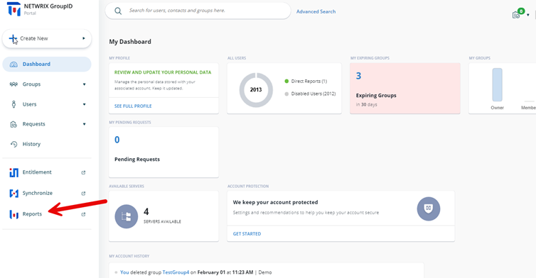
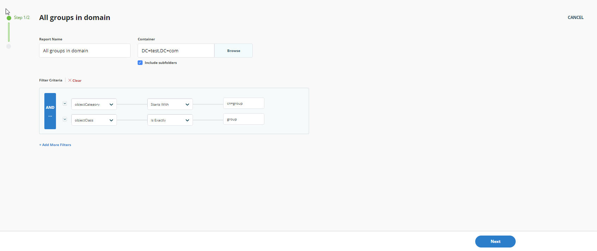
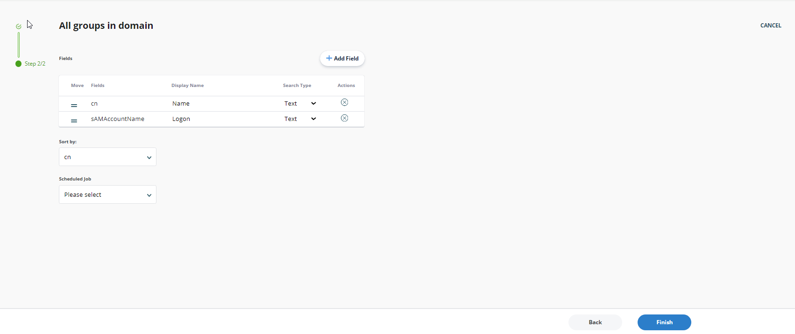

# Generate a Report of All Groups in the Domain

## Applies To

Netwrix Directory Manager 11

## Overview

Use the reporting feature in Netwrix Directory Manager to create a list of all groups in your domain. You can customize the report title, apply filters, choose which fields to include, and export the results in PDF, Excel, or HTML format.

## Instructions

### Steps to Generate a Report of All Groups

1. Open the Netwrix Directory Manager portal and go to the **Reports** options.  
   
2. Select **Group Reports** > **All Groups in the Domain**.
3. Click **Create Report**. This launches the **Create Report** wizard.  
   
4. On the first page, enter a custom title for your report in the **Report Name** box. The default title is **All Groups in Domain**.
5. Click **Browse** to open the **Select Container** dialog box and select the required source container. The default selection is the Global Catalog.
6. Select the **Include sub-folders** check box to include sub-folders for the selected container in the report.
7. In the **Filter Criteria** section, modify the default LDAP filter as required. This filter is used to select items from the container to display in the report. To add additional filters, click **Add More Filters**.
8. Click **Next**.  
   
9. The **Fields** section displays the fields that will be included in the report. You can add or remove fields from the list, and you can move fields to change their order.
10. From the **Sort By** drop-down list, select the field by which you want to sort the results in the report.
11. From the **Schedule** drop-down list, select the schedule for the report. If you select a schedule, the report will run automatically at the specified time.
12. Click **Finish**.  
    
13. The report is displayed based on the settings you configured in the portal. The report includes the following information:
    - Connected identity store name
    - Selected container
    - Number of records fetched
    - Date the report was created
    - Filter applied while creating the report
    - List of report results

    > **NOTE:** The report is listed on the template's page. You can create multiple reports from the same template.
14. To download the report, click **Download** and select the format for the report (PDF, Excel, or HTML).
15. You can also pin the report to the **Dashboard** by clicking **Pin Report**.
