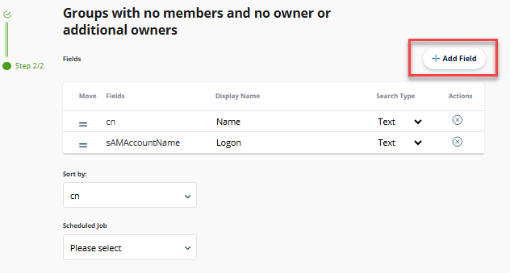

# Generate a Report on Groups Without Members or Owners

## Applies To

Directory Manager 11

## Overview

Netwrix Directory Manager (formerly GroupID) allows you to generate reports on groups that have no members and no owners or additional owners. The Reports module is a free tool for running reports on Active Directory and Microsoft Exchange/Office 365. This article explains how to generate this report using the Reports portal.

## Instructions

### Generate a Report on Groups Without Members or Owners

1. In the Directory Manager portal, select **Reports** from the left navigation bar. The Reports portal will open in a new browser tab.

   

2. Click the **Group Reports** button on the navigation bar.

3. In the Groups category, type **Groups with no members** in the search bar.

4. Select the first report template in the list.

   

5. Click **Create Report** to start the report creation wizard.

   

6. The report creation wizard prompts you to enter a name for the report. Choose the search scope within the directory and provide a filter criterion. By default, the wizard searches the Global Catalog. To limit the scope to a particular container:
   1. Click **Browse** to launch the **Select Container** dialog box and select the required source container.
   2. Select the **Include sub-containers** check box to include sub-containers in the report.
   3. In the **Filter Criteria** box, modify the default LDAP filter. The default filter generates a list of all groups in the domain.
   4. Add new clauses, **XAdditionalOwner Not Present** and **member Not Present**, to fetch a list of all groups without members and without owners or additional owners.

   

7. Click **Next**.

8. The **Report Fields** page displays the fields that will be included in the report. To add more fields, click **Add**. To remove a field, select it and click the **X**. You can change the order of fields using the two lined icon.

   

9. Click **Finish** to generate the report.

10. The report will be generated. You can download the report in your desired format or pin the report to the Reports portal Dashboard.

    