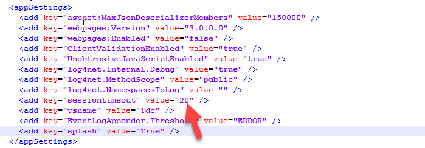

# How to Change the User Session Timeout for Portals

## Applies To
- Netwrix Directory Manager 10 – Self-Service and Password Center portals

## Overview
By default, a session in the Self-Service or Password Center portal ends after 20 minutes of inactivity. When this occurs, users are redirected to the **Login** page and must re-enter their credentials to continue. You can adjust the session timeout value to balance convenience and security. Increasing the timeout makes it easier for users to stay logged in, but may reduce security. Decreasing the timeout enhances security, but may require users to log in more frequently.

## Instructions
You can change the `sessiontimeout` value key in the `web.config` file of a portal. If you have multiple portals, remember to change the value in each portal's respective `web.config` file.

The file is available at the following locations for the respective portals:

### Self-Service Portal
- `C:\Program Files\Imanami\<Directory Manager 10.0>\SelfService\Inetpub\<portal_name>\Web`

### Password Center User Portal
- `C:\Program Files\Imanami\<Directory Manager 10.0>\PasswordCenter\Inetpub\<portal_name>\Web`

### Password Center HelpDesk Portal
- `C:\Program Files\Imanami\<Directory Manager 10.0>\PasswordCenter\HelpDesk\Inetpub\<portal_name>\Web`

1. Open the `web.config` file with a text editor.
2. Search for `<appSettings>` and look for the following line:
   ```xml
   <add key="sessiontimeout" value="20" />
   ```
3. Set the value in minutes as needed. If the key does not exist, add the line and save the changes.


