# How to Copy the Design of Portal via SQL Query

## Overview

This article provides step-by-step instructions for copying a portal design between environments using SQL queries. The process covers scenarios for the same SQL server and database, different databases on the same server, and different SQL servers.

## Instructions

### Copy the Design Within the Same SQL Server and Database

1. Go to the database used with the test server.
2. Select the database and create a new query.  
   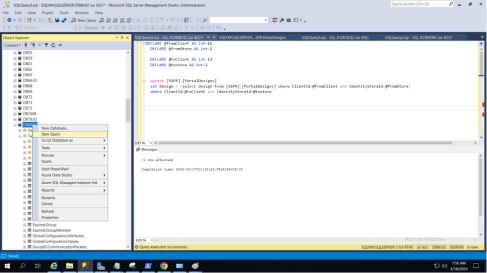
3. Enter the following query:

```sql
DECLARE @fromClient AS int = n
DECLARE @fromStore AS int = n
DECLARE @toClient AS int = n
DECLARE @tostore AS int = n

UPDATE [SSPR].[PortalDesigns]
SET Design = (SELECT Design FROM [SSPR].[PortalDesigns] WHERE ClientId = @fromClient AND IdentityStoreId = @fromStore)
WHERE ClientId = @toClient AND IdentityStoreId = @tostore
```

4. In `@fromClient`, enter the Client ID of the portal you want to copy. For example, to copy the design of Portal 1, use Client ID 11.  
   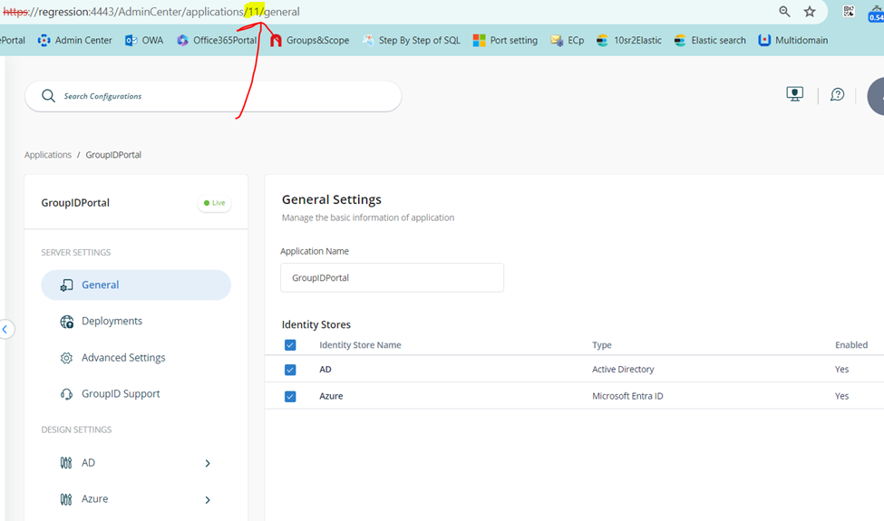
5. In `@fromStore`, enter the Identity Store ID. For example, use 2.  
   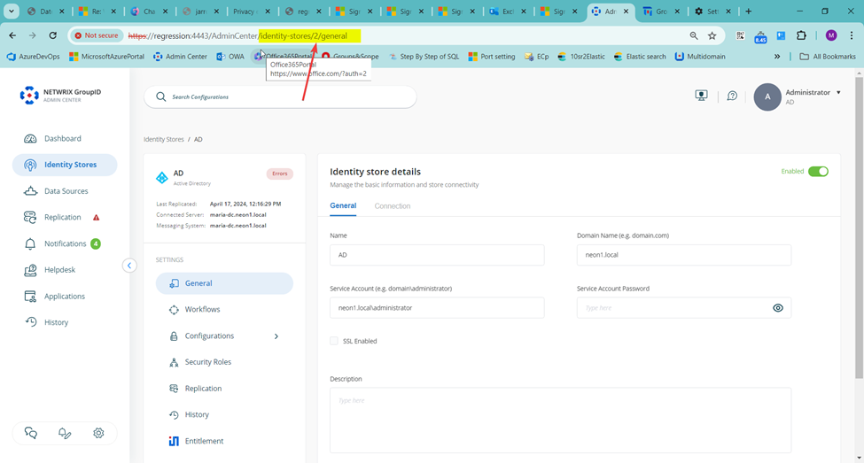
6. In `@toClient` and `@toStore`, enter the Client ID and Identity Store ID for the target portal. For example, Client ID 13 and Store ID 2.
7. Run the query.
8. The following screenshot shows the executed query:  
   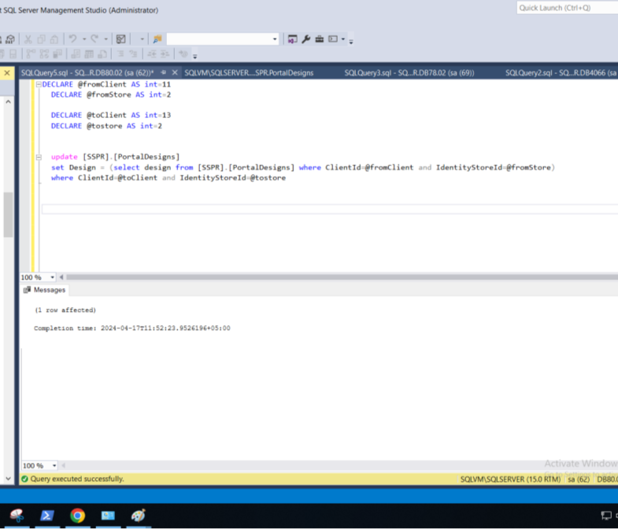

### Copy the Design with the Same SQL Server and Different Databases

Environment: Test instance configured with **SQLTestServer-DB1**, production instance configured with **SQLTestServer-DB2**.

1. Go to SQL Server and create a new query.
2. Enter the following query:

```sql
DECLARE @fromClient AS int = n
DECLARE @fromStore AS int = n
DECLARE @toClient AS int = n
DECLARE @tostore AS int = n

UPDATE [toDB].[SSPR].[PortalDesigns]
SET Design = (SELECT Design FROM [fromDB].[SSPR].[PortalDesigns] WHERE ClientId = @fromClient AND IdentityStoreId = @fromStore)
WHERE ClientId = @toClient AND IdentityStoreId = @tostore
```

3. In `@fromClient`, `@fromStore`, `@toClient`, and `@toStore`, enter the appropriate Client ID and Store ID values as described above.
4. In `[toDB]`, enter the database name of the production portal.  
   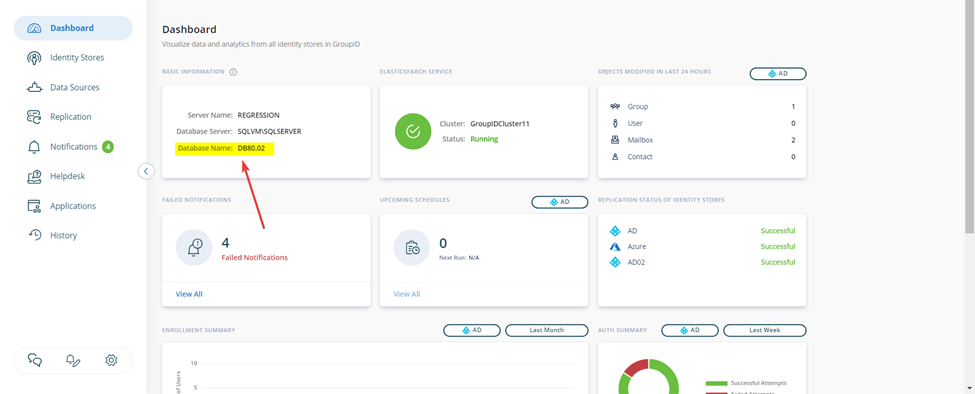
5. In `[fromDB]`, enter the database name of the test portal.
6. Run the query.
7. The following screenshot shows the executed query:  
   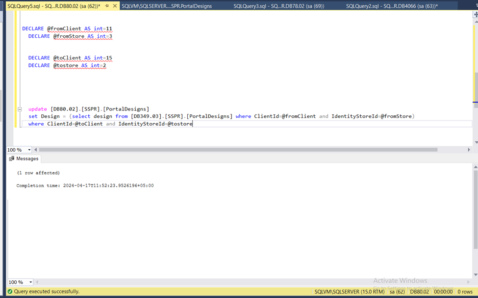

### Copy the Design with Different SQL Servers and Databases

Environment: Test server configured with **DB1**, production server configured with **DB2**.

1. On the test server, connect to the SQL Server instance where you want to create the linked server.
2. In Object Explorer, go to **Server Objects** and click **Linked Servers**.
3. Create a new linked server.
4. In the **New Linked Server** window, enter the name of the server you want to link.
5. Select **Server type** as **SQL Server**.  
   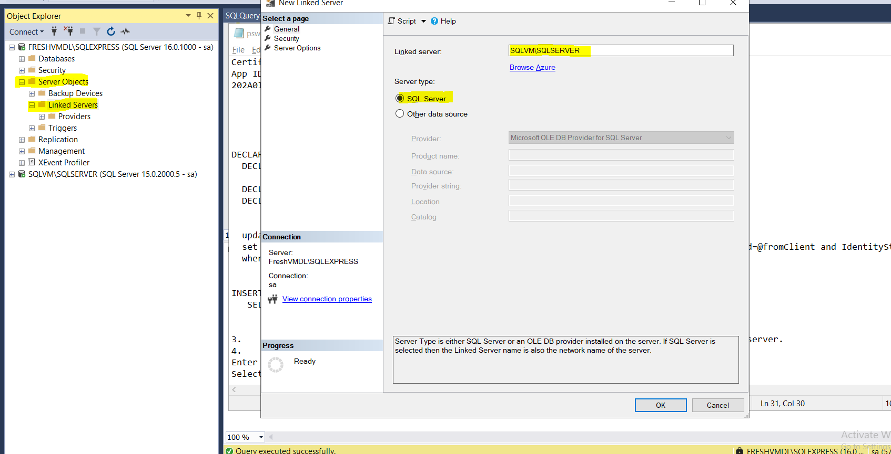
6. Select **Security** from the left pane, choose the appropriate login option, and enter the server credentials.
7. Click **OK**. The linked server will appear in the list.  
   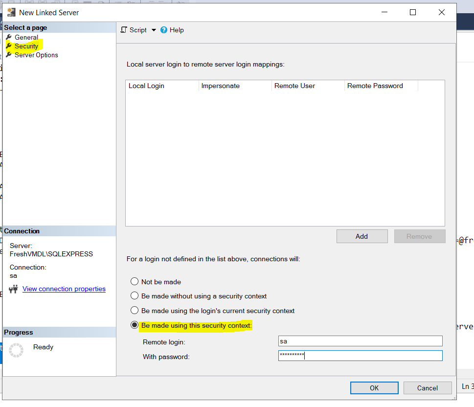

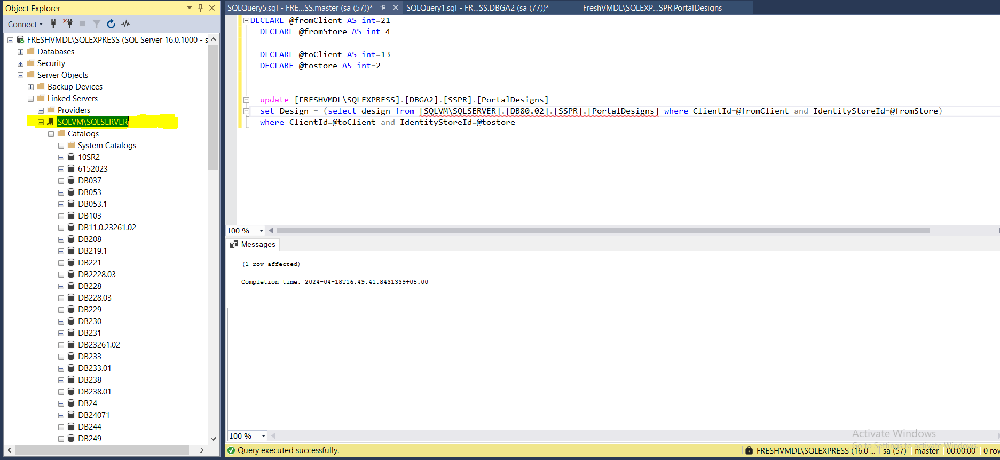

8. Go to the Netwrix Directory Manager portal of the test server and make the required changes to the portal design.
9. Return to SQL Server.
10. Right-click the server and select **New Query**.  
    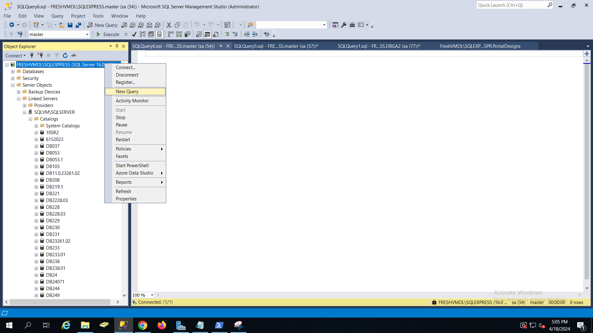
11. Enter the following query:

```sql
DECLARE @fromClient AS int = n
DECLARE @fromStore AS int = n
DECLARE @toClient AS int = n
DECLARE @tostore AS int = n

UPDATE [toSourceServer].[toDB].[SSPR].[PortalDesigns]
SET Design = (
    SELECT Design FROM [fromSourceServer].[fromDB].[SSPR].[PortalDesigns]
    WHERE ClientId = @fromClient AND IdentityStoreId = @fromStore
)
WHERE ClientId = @toClient AND IdentityStoreId = @tostore
```

12. In `@fromClient`, `@fromStore`, `@toClient`, and `@toStore`, enter the appropriate Client ID and Store ID values as described above.
13. In `[toSourceServer]`, enter the server name of the production server.  
    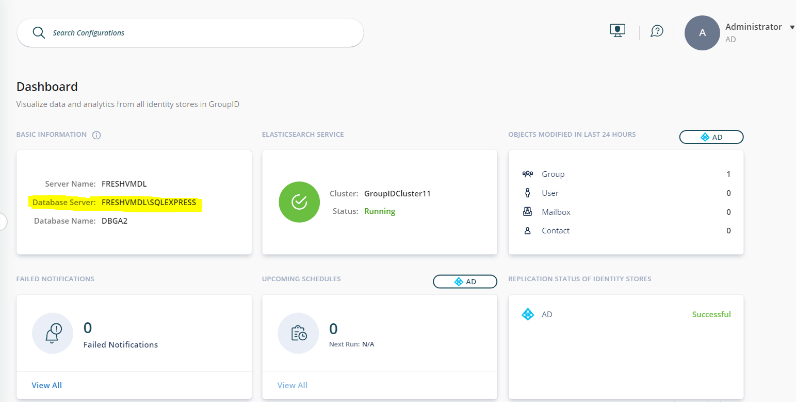
14. In `[fromSourceServer]`, enter the server name of the test server.
15. In `[fromDB]` and `[toDB]`, enter the database names as described above.
16. Execute the query.  

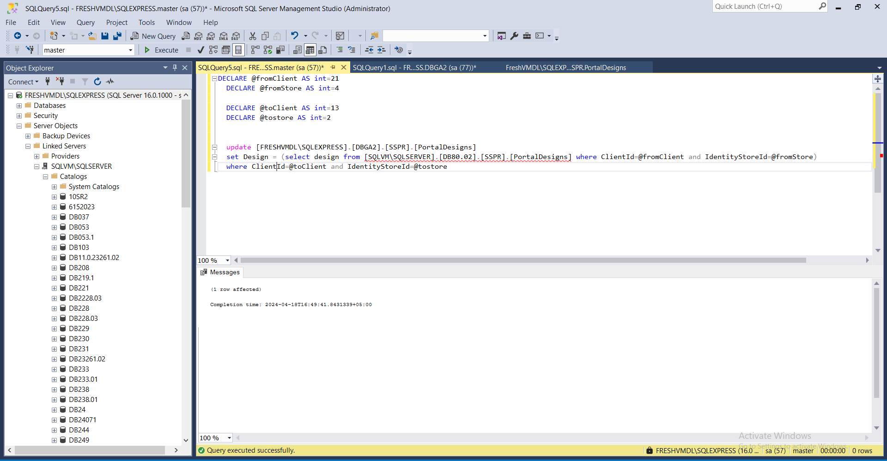
