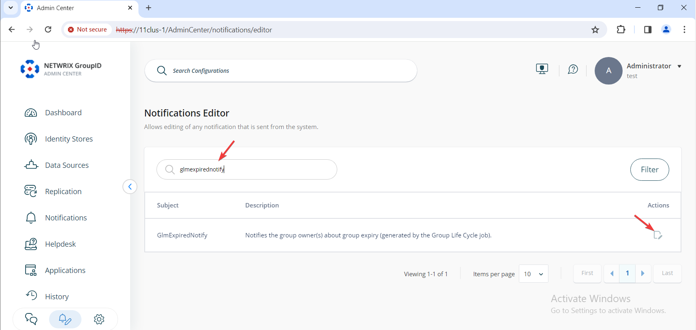
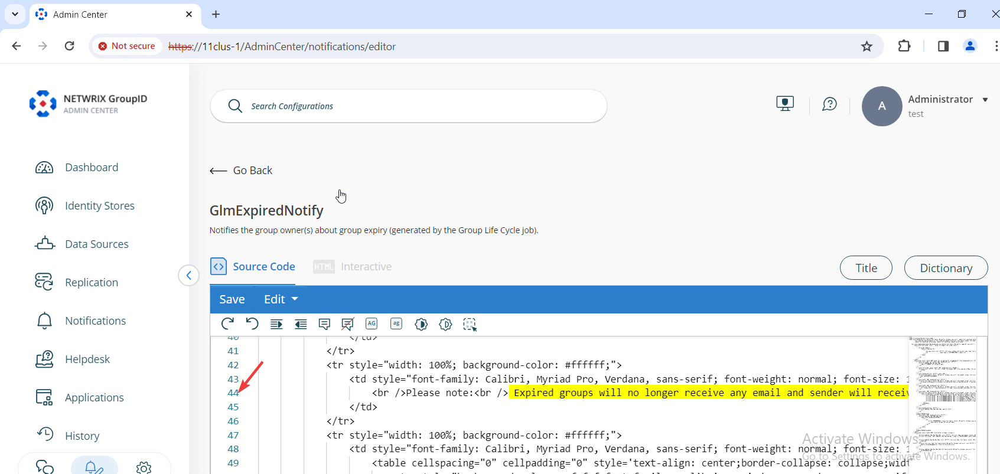
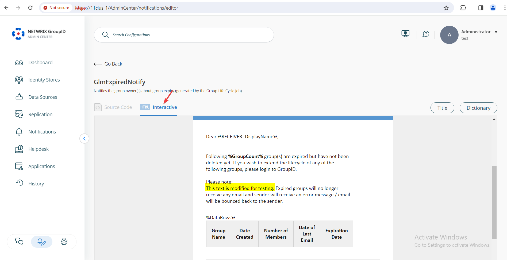
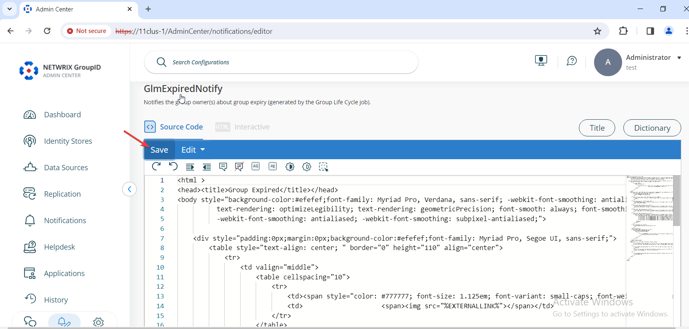
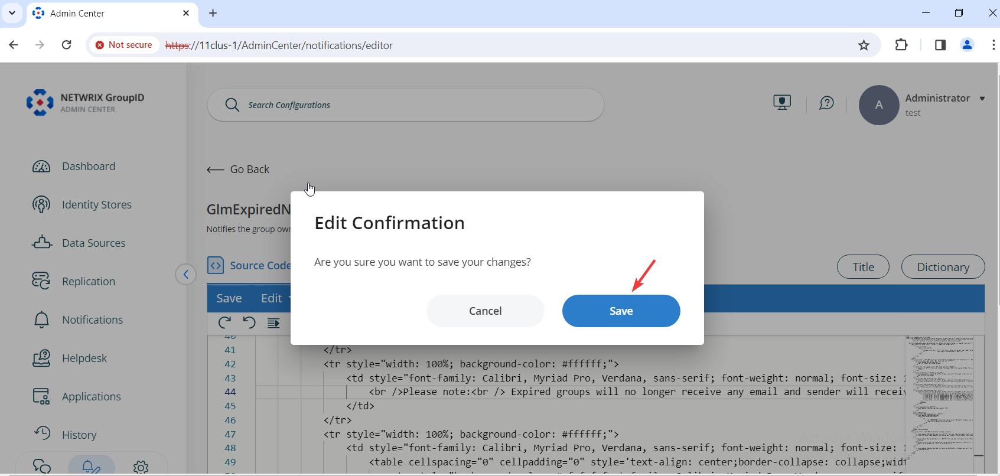

# How To Modify Expiring Group Email Template

## Applies To
Netwrix Directory Manager 11

## Overview
By default, the Group Lifecycle notification email in Netwrix Directory Manager 11 only explains the consequence of not renewing distribution lists. You can customize the email body to include additional information, such as the impact of not renewing security groups or any other custom text. This article explains how to edit the static text in the group expiry notification email.

## Instructions
1. In the Netwrix Directory Manager Admin Center, select **Notifications** then **Notification Editor**.  
   

2. On the next page, you will see a list of all notifications in Netwrix Directory Manager. Search for the notification named `GLMExpiredNotify`. Under **Actions**, click **Edit**.  
   

3. Select the **Source Code** tab and go to line 44. This line contains the consequence of not renewing a group. Edit the text as needed to include your custom message.  
   

4. After making your changes, go to the **Interactive** tab to preview the results in a clean, easy-to-read format.  
   

5. If you are satisfied with the output, return to the **Source Code** tab and click **Save**. Confirm your changes by clicking **Save** again.  
     
   
