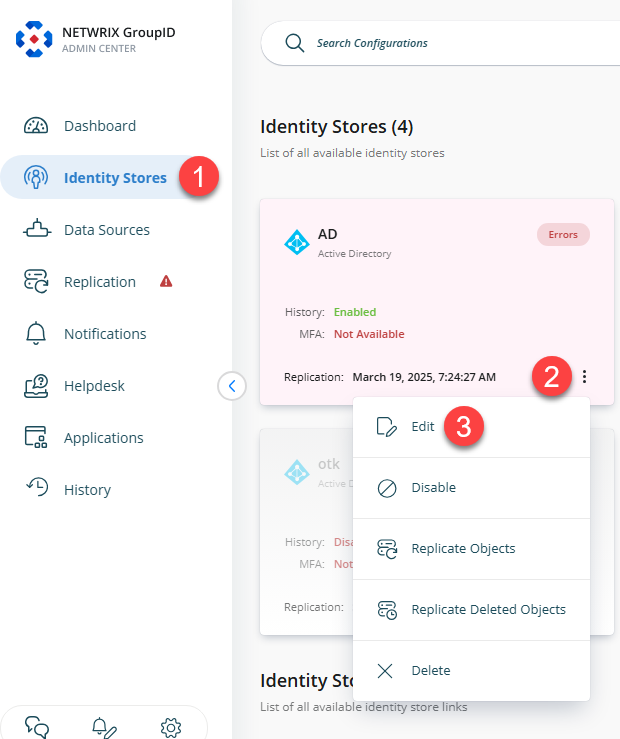
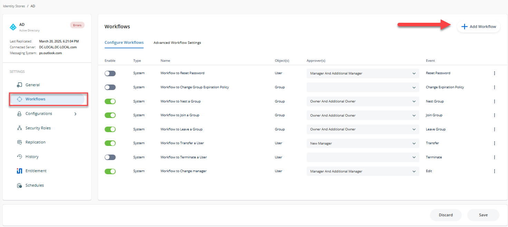
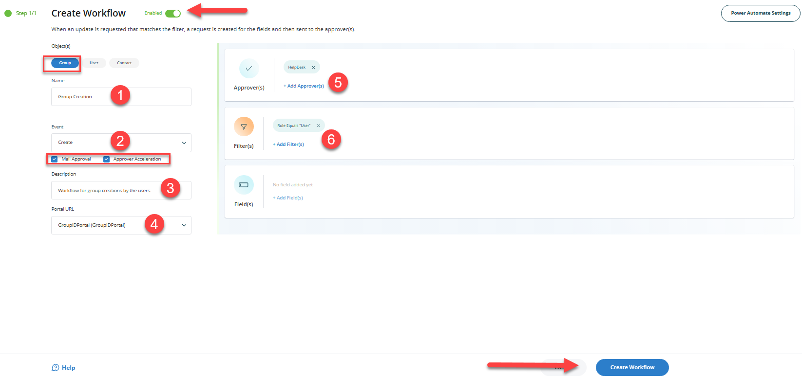
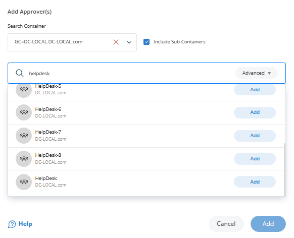

# How to Trigger a Workflow When a User Creates a Group

## Applies To

Netwrix Directory Manager 11 or above

## Overview

This article explains how to implement a workflow approval process for group creation using Netwrix Directory Manager (formerly GroupID). By configuring workflow routes, you can ensure that all new groups created via the Self-Service portal are subject to approval before being committed to Active Directory.

The workflow route consists of the following components:

- The object the workflow applies to (e.g., group)
- The event that initiates the workflow (e.g., create)
- A filter condition that defines when the workflow is triggered (e.g., user role)
- The approver(s) responsible for reviewing and approving the request

If the workflow conditions are met, a request is generated and sent to the approvers. Once approved, the group creation takes effect in Active Directory.

> **NOTE:** You must configure notifications for an identity store for workflows to work.

## Instructions

1. In the **Netwrix Directory Manager Admin Center**, click the **Identity Stores** node from the Navigation Bar.
2. On the **Identity Stores** tab, click the three-dot icon and click the **Edit** button of an identity store to open its properties.  
   
3. Click the **Workflow** tab.  
   
4. Click **Add Workflow**.
5. In the **Object(s)** list, select *Group*.
6. Enter a name for the workflow in the **Name** box. For example, `Group Creation`.
7. In the **Events** drop-down list, select *Create*.
8. Make sure the **Enabled** check box is selected for the workflow to apply.
9. Select the **Enable mail approval** check box to enable the approver to approve or deny a workflow request from within the workflow email notification.
10. The **Enable approver acceleration** check box applies if approver acceleration has been enabled for the identity store. To exempt this workflow route from approver acceleration, clear this check box.
11. In the **Description** box, enter a brief description of the workflow. For example, `This workflow tracks creation of groups by people from User Security Role.`
12. In the **Portal URL** drop-down list, select a Self-Service portal URL to include in the workflow email notifications. The URL would redirect the recipients to the portal for acting on the respective request, such as approve or deny it.  
    
13. Use the **Filters** area to define a condition that must be met for the workflow to trigger. Leave the filter blank to apply the workflow to all users. If a condition is set and not met, the workflow will not initiate. For example, the following filter targets users in the User security role:

    | Field | Condition | Value |
    |---|---|---|
    | Role | Equals | `User` |

    With this filter, when a user from the User role creates a group via the Self-Service portal, the workflow is triggered and the changes are held for approval. Users outside this role can create groups without triggering the workflow.
14. In the **Approvers** area, click **Add**.  
    
15. Select the user or group responsible for approving requests generated by this workflow. For best results, assign an administrator or helpdesk member rather than group owners.
16. Click **OK** to save the approver configuration.
17. Click **OK** on the **Workflow Route** dialog box and then on the **Workflow** tab to finalize the configuration.

Once these steps are complete, this configuration ensures that group creation requests submitted via Netwrix Directory Manager by User security role members are subject to approval before being finalized.
