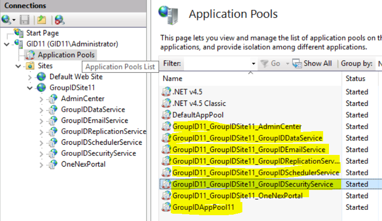

# How to Uninstall Directory Manager

## Overview

This article explains how to uninstall previous versions of Netwrix Directory Manager (formerly GroupID) to upgrade to the latest version. It also provides instructions for completely removing Directory Manager from your machine.

## Instructions

The steps below guide you through uninstalling Netwrix Directory Manager for an upgrade and completely removing it from your machine.

> **NOTE:** Before you uninstall Directory Manager, ensure that the logged-in user is a member of the local Administrators group on the machine. Make sure the Directory Manager portal is fully closed before you begin the uninstall process.

### Uninstall Netwrix Directory Manager to Upgrade to a Newer Version

1. Double-click the **setup.exe** file in the Directory Manager installation package to launch the Directory Manager Installer.  
   
2. Click **Uninstall Directory Manager** to remove the application files via **Programs & Features** in Control Panel.
3. Proceed with the upgrade to the newer version of Directory Manager.
4. Click the **Install Directory Manager** link on the Directory Manager Installer to install the latest version.
5. After installation, run the Upgrade wizard to make earlier version data compatible with the new version.

### Completely Uninstall Directory Manager from the Machine

1. Click **Uninstall Directory Manager** on the Directory Manager Installer to uninstall the application files from your computer.
2. Remove the following components to ensure complete uninstallation:
   - Directory Manager installation directory
   - Other relevant directories
   - Directory Manager DLLs
   - Registry keys
   - Services files
   - Directory Manager application pool
   - Directory Manager certificates

### Remove the Directory Manager Installation Directory

1. On the Directory Manager machine, navigate to `X:\Program Files\Imanami` (where X represents the installation drive).
2. Delete the directory named **Directory Manager [version]** (for example, Directory Manager 11).

### Remove Other Relevant Directories

1. On the Directory Manager machine, right-click the Windows button and select **Run**.
2. When the dialog box populates, type `%ALLUSERSPROFILE%\Imanami` and press Enter.
3. From the location referenced in the command, delete the **Directory Manager** folder.

### Remove Directory Manager DLLs

1. On the Directory Manager machine, navigate to `C:\Windows`.
2. Search for all DLL files with names starting with **Netwrix**. You can find the files by typing `Netwrix*.dll` in the Windows Explorer Search box.
3. Delete these files.

### Remove Registry Keys

1. On the Directory Manager machine, open **Registry Editor**.
2. Delete the following registry key (for Directory Manager 11.0):

```text
HKEY_LOCAL_MACHINE\SOFTWARE\Imanami\GroupID\Version 11.0
```

### Remove Directory Manager Services Files

1. On the Directory Manager machine, navigate to `C:\Windows\Microsoft.NET\Framework64\v4.0.30319\Temporary ASP.NET Files`.
2. Delete the **root** folder.

### Remove Portal Files

1. Open the Internet Information Services (IIS) console by typing `inetmgr` in the Windows **Run** dialog box.
2. Under the **GroupIDSite** node in the console tree, locate the portals you have created using the portal names.
3. Delete each portal by right-clicking it and selecting **Remove** from the shortcut menu.
4. After removing the portals, navigate to `C:\Windows\Microsoft.NET\Framework64\v4.0.30319\Temporary ASP.NET Files`.
5. Delete each portal folder one by one.

### Remove the Directory Manager Application Pool

1. Open the Internet Information Services (IIS) console by typing `inetmgr` in the Windows **Run** dialog box.
2. Expand the **\<machine name\>** node in the console tree and click **Application Pools**.
3. On the Application Pools page, delete **Directory Manager App Pool 11** and all other pools that start with **GroupID11_GroupIDSite11** prefixes.  
   

### Remove Directory Manager Certificates

1. Open the Internet Information Services (IIS) console by typing `inetmgr` in the Windows **Run** dialog box.
2. Click the **\<machine name\>** node in the console tree. On the **Features View** tab, select **Server Certificates** in the **IIS** section.
3. Delete these certificates bound to **GroupIDSite** (the site deploying Directory Manager Data Service):
   - GroupIDSecurityService
   - Netwrix Directory Manager Certificate

> **NOTE:** Do not remove these certificates if another Directory Manager version is installed on the machine.
