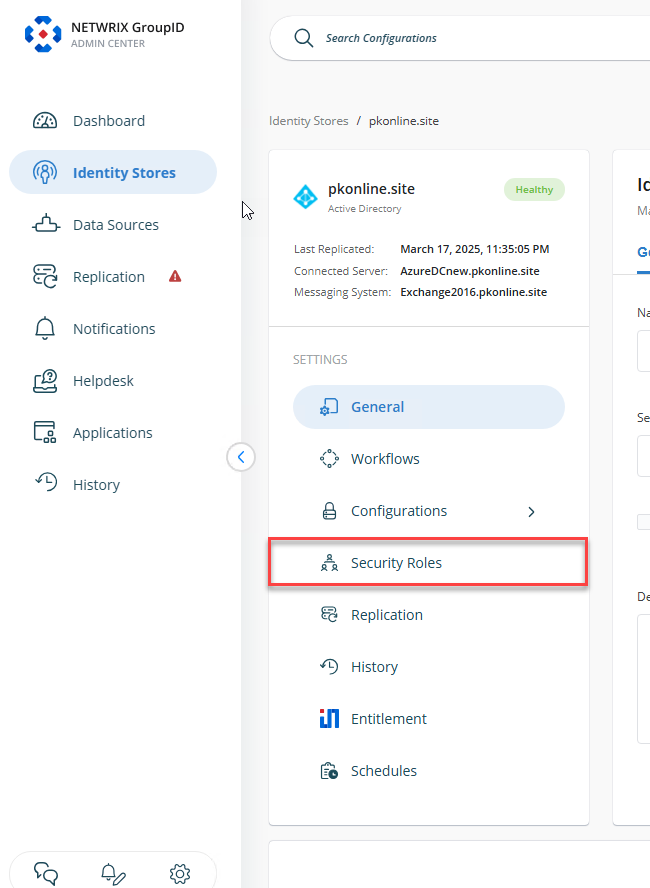
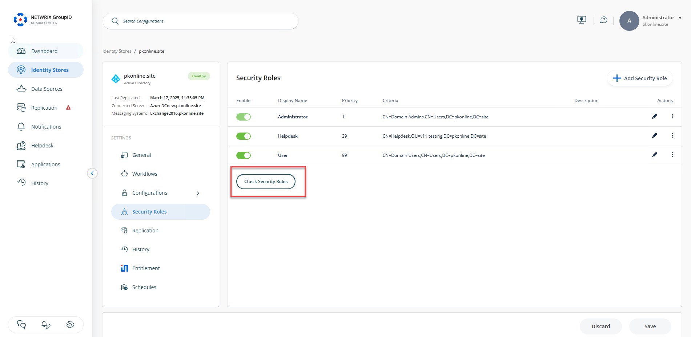

# How to View Roles Assigned to a User v11

## Applies To
Netwrix Directory Manager 11

## Overview
This article explains how to view the security roles assigned to a user in an identity store within Netwrix Directory Manager. Security roles control the access and permissions users have across different Netwrix Directory Manager clients, such as portals, the admin center, and mobile apps. Understanding role assignments helps you verify user privileges and troubleshoot permission-related issues.

Netwrix Directory Manager includes built-in roles such as:

- **Administrator:** Full permissions in the identity store.
- **Helpdesk:** Can reset passwords and unlock accounts (not available for Microsoft Entra ID stores).
- **User:** Can manage groups, update directory profiles, and handle direct reports.

These roles can be customized or extended with additional custom roles as needed.

> **NOTE:** Roles are only shown for deployed clients. For example, if the mobile app is not deployed for the selected identity store, it will not appear in the **Client name** list.

## Instructions
1. Log in to the **Netwrix Directory Admin Center**.  
2. Click **Identity Stores** in the left pane.  
3. Click the three-dot icon next to the relevant identity store and select **Edit**.  
   
4. Click **Security Roles** under the **Settings** section.  
   
5. Click **Check Security Roles** and the dialog box opens.  
   
6. From the **Client name** drop-down list, select one of the following Netwrix Directory Manager clients:
   - Select a deployed client (e.g., portal) to view the user's role in that client.
   - Select **None** to view the user's highest privileged role across the entire identity store.  
   
7. Search for a user using one of the following methods:
   - Enter a search string and press **Enter** to filter users by username.
   - Click **Advanced** to search by additional fields such as name, department, company, or email. Click **Search** and select the desired user.
8. Once a user is selected, their highest-ranked role for the chosen client is displayed, including the role’s priority number.
9. Click **Close** to exit the dialog box.
