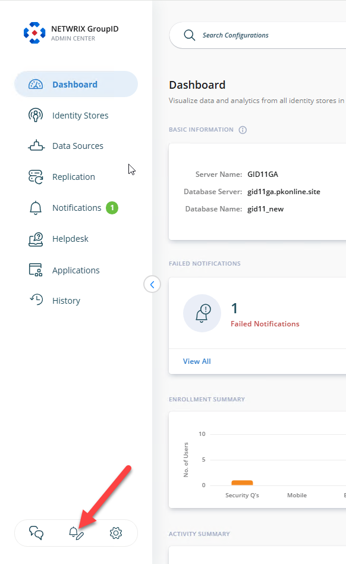
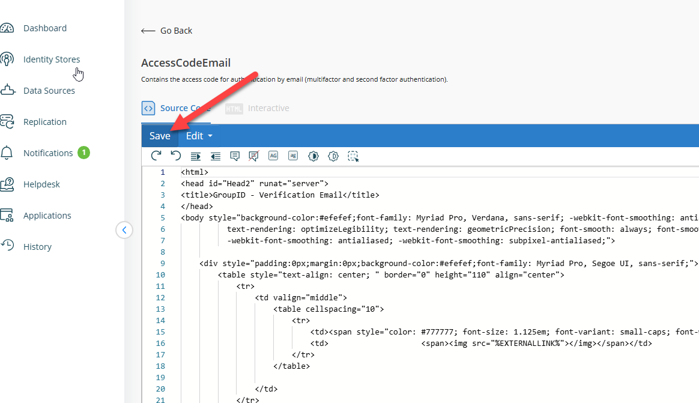

# How to Customize Notifications

## Overview

This article explains how to customize notification templates in **Netwrix Directory Manager** (formerly GroupID). **Directory Manager** generates notifications for events such as group management, workflows, and profile validation. These notifications are sent to administrators, object owners, and other specified recipients.

Email notification templates are predefined and can be customized for the following elements:

- Logo
- Subject line
- Message content and formatting

## Instructions

1. Log in to the **Directory Manager Admin** portal and click **Notification Editor**. The editor displays a list of all notifications generated by **Directory Manager**.

   

2. Select an event from the **Category** list to view related notifications. You can also enter a search string and click **Search** to filter notification names.

3. Double-click a notification template to open it for editing.

4. Click the **HTML** or **Source** tiles in the ribbon to edit the template in the WYSIWYG or HTML editor.

5. Customize the template as needed:

   - Change the logo: Remove the current logo and insert a new one.
   - Change the subject line: Click the **Title** tile. In the **Edit Title** dialog box, update the subject line and click **OK**.
   - Format the notification content: Use formatting options to apply heading styles, change font and size, adjust alignment, and more.
   - Modify the notification content: Edit the message as needed. You can replace tags with other relevant tags. Tags display attribute values in the notification and are formatted as ` %ATTRIBUTE_NAME% `. For example, ` %TARGETOBJECT_DisplayName% ` displays the display name of the target object, and ` %REQUESTOR_mail% ` shows the requestor's email address. Click the **Dictionary** tile to view available tags.

6. Click **Save** to apply your changes.

   