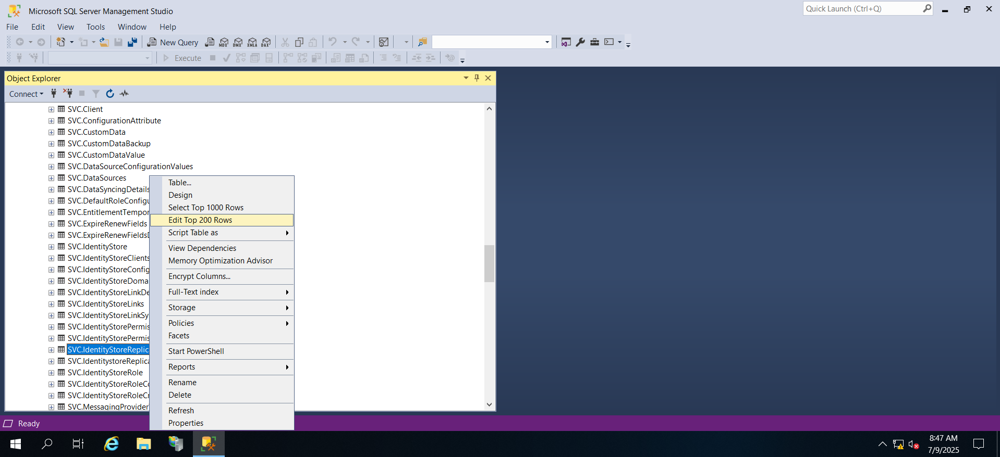

# How to Run Replication for a Specific Object Type

## Applies To

Directory Manager 11

## Overview

This article explains how to force a full replication from scratch in **Netwrix Directory Manager** (formerly GroupID) if the server has been unavailable for more than an hour. A full replication resynchronizes all Active Directory objects without deleting existing data.

When you create a new identity store, **Netwrix Directory Manager** replicates all Active Directory objects (users, groups, organizational units) during the first cycle. After that, it performs only delta replications. If the server is down for an extended period—for example, due to Windows updates, network issues, or planned maintenance—some changes may be missed. In that case, run a full replication as described below.

> **NOTE:** This process does not delete existing data. It only forces **Directory Manager** to replicate objects again, so you can safely perform this activity on production servers.

## Prerequisites

- Access to the SQL database used by **Netwrix Directory Manager**.
- Permissions to edit the **SVC.IdentityStoreReplication** table.

## Instructions

1. Open the SQL database that **Directory Manager** uses and go to the table named **SVC.IdentityStoreReplication**.
2. Right-click the table and select **Edit Top 200 Rows**.

   

3. Expand the column named **TimeStamps**. The content will look similar to the following:

   

4. The **TimeStamps** column contains a long string of values. To force replication for users, find the entry labeled **User** and change its value to **0**. In the example above, the **User** entry shows a long number before modification.

5. After replacing the value with **0**, the entry should look similar to the following:

   

6. If you want to replicate other object types from scratch, repeat this process for each relevant value.

7. Once finished, click **Save All**.

   

8. Go to the **Admin Panel** of **Directory Manager**. Navigate to the **Replication** node and click **Force Replicate Now**. Wait for the replication to complete.