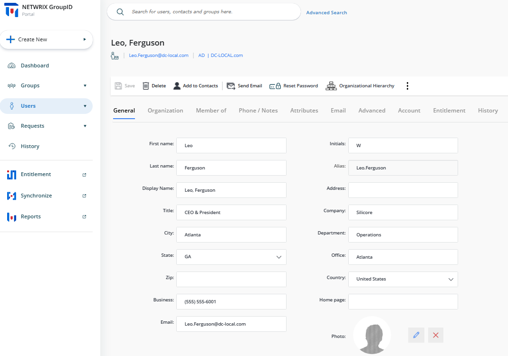
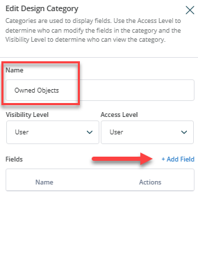
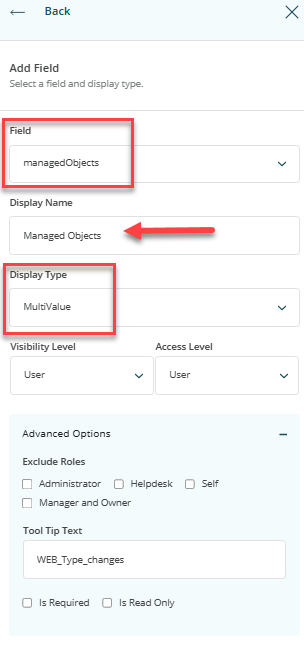

# How to View a List of Objects Owned by a User in the Portal

## Overview

Netwrix Directory Manager (formerly GroupID) allows you to view all groups owned by a specific user in the portal. By adding a new field mapped to the **managedObjects** attribute in the user properties, you can display a list of groups that a user owns. This article explains how to configure the portal to show this information.

> **NOTE:** Before making any changes to your environment, it is highly recommended to create a backup, snapshot, or checkpoint of the Directory Manager server.

The default properties page for users does not display owned groups:

## Instructions

### Add the Owned Objects Field to User Properties

1. In the **Directory Manager Admin Center**, go to the **Applications** tab in the left navigation bar.
2. Click the three-dot icon for the portal you want to modify, then click **Settings**.
   
   

3. In the portal settings, click the identity store name under **Design Settings** for which you want to make design changes.
   
   

4. Click the **Properties** button and select **User** from the **Select Directory Object** drop-down list.
5. Click the **Plus** button to create a new category on the User Properties page.
   
   

6. Provide a name for the new category and click **Add Field**.
   
   

7. Select **managedObjects** from the **Field** drop-down list, then provide a display name for the new field and select **Display Type** as **MultiValue**.
   
   

8. Click **OK** to save the changes.
9. Refresh or relaunch the Directory Manager Portal. In the properties of any user, you will now see a new tab (for example, **Owned Objects**) listing all groups owned by the user.
   
   