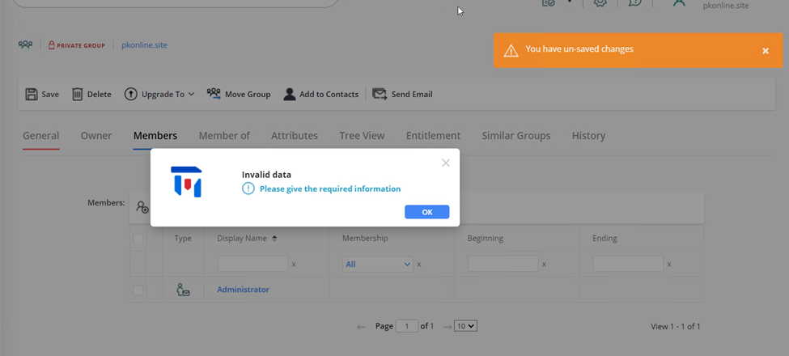
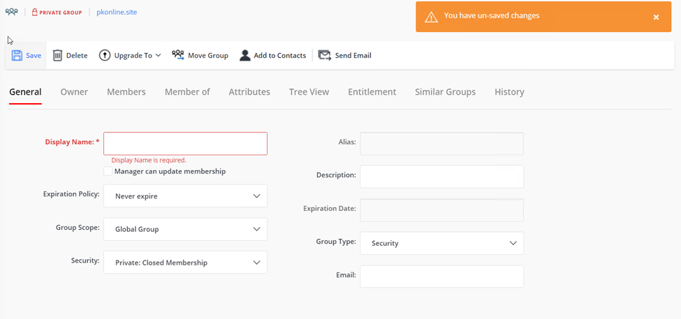
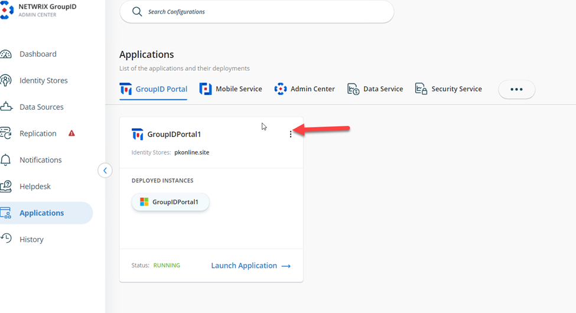
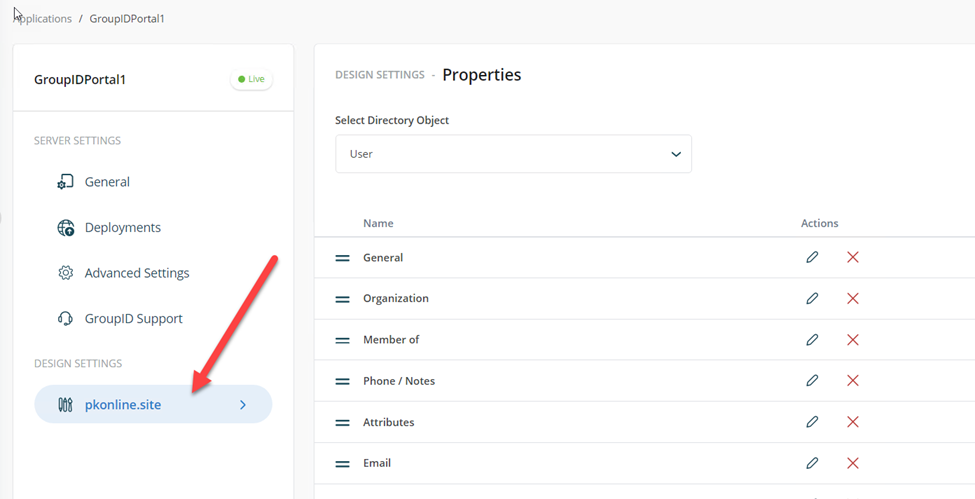
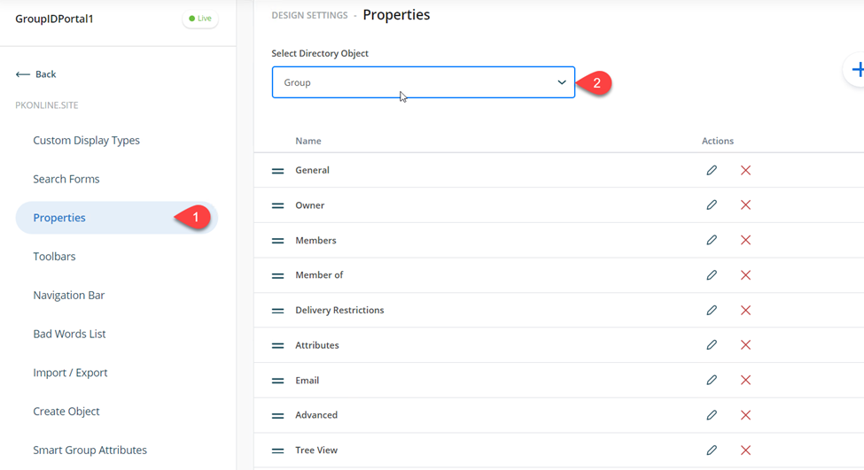
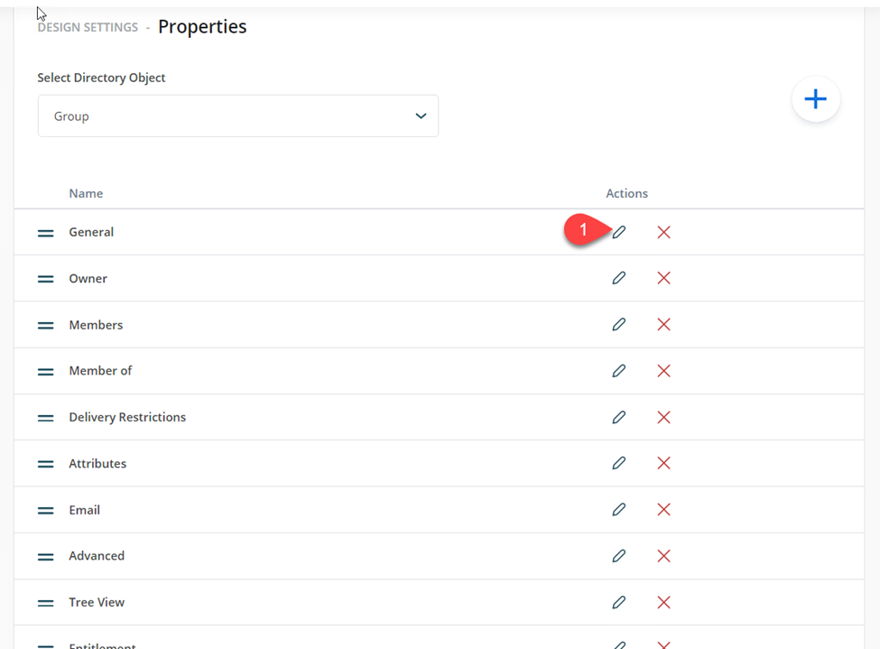
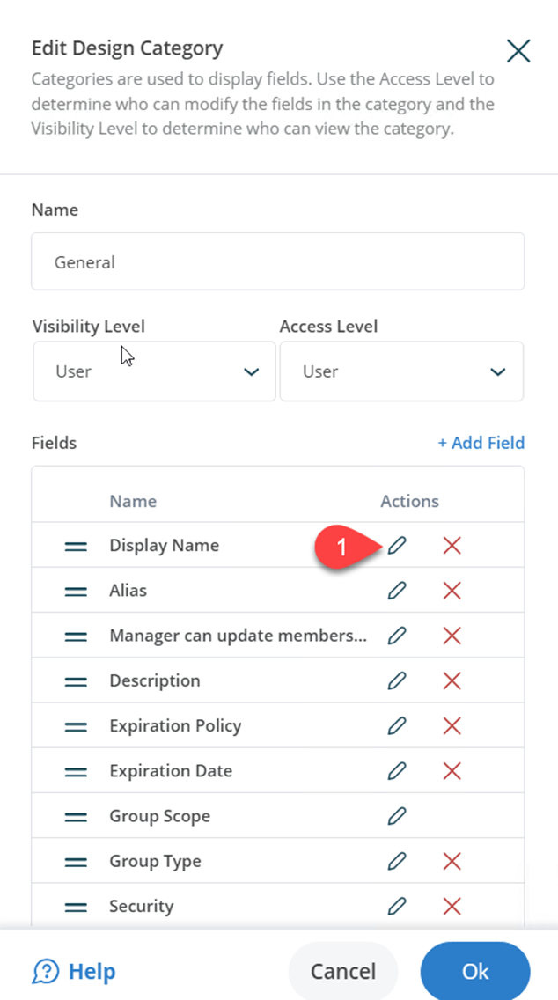

# Remove the DisplayName Requirement for Groups Created in Active Directory

## Applies To
- Netwrix Directory Manager 11

## Overview
When you integrate Netwrix Directory Manager with an existing Active Directory environment, some groups may have been created directly in Active Directory. These groups might not have the **displayName** attribute populated, since it is not required by Active Directory.

Netwrix Directory Manager, however, requires the **displayName** attribute because it uses this value to populate other fields, such as Alias and CN. If you try to save changes to one of these groups in the **Self‑Service Portal (SSP)** and **displayName** is missing, you will receive an error. You cannot save changes until **displayName** is populated or the requirement is removed.

This article describes a workaround that allows you to save changes to these groups by making the **displayName** attribute optional in the portal design.

 

## Instructions
1. In the Netwrix Directory Manager Admin Center, go to the **Applications** tab. Open the settings for the application where you want to remove the **displayName** requirement by clicking the **Settings** button (top right corner of the application card).
   
   

2. Under **Design Settings**, click the domain name.
   
   

3. Go to the **Properties** tab and set the **Directory Object** to **Groups**.
   
   

4. Edit the **General** field by clicking the pencil icon.
   
   

5. Edit the **DisplayName** field by clicking the pencil icon in the Design category window.
   
   

6. Expand **Advanced Options** and uncheck the **Is Required** box.
   
   

7. Click all **OK** buttons to save your changes, then log in to your portal. You should now be able to save changes to a group even if the **displayName** attribute is not populated.

8. To apply this change to Smart Groups, set the **Directory Object** to **SmartGroup** in step 3 then complete the remainder of the steps.
