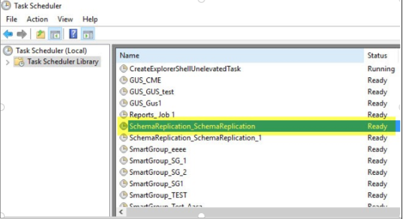
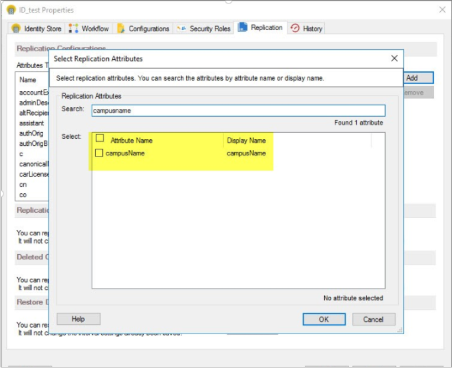
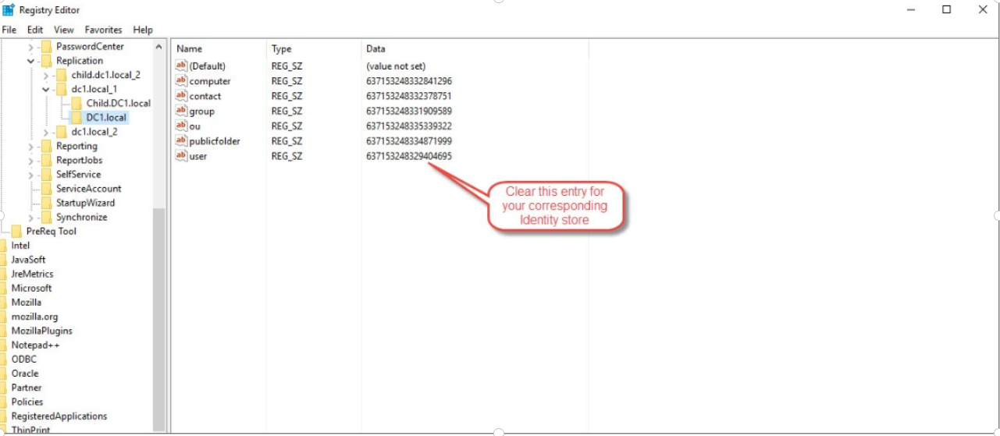

# Replicating Custom AD Attributes to Elasticsearch

## Applies To
Netwrix Directory Manager 10

## Overview
Netwrix Directory Manager 10 allows you to replicate custom Active Directory (AD) attributes to the Elasticsearch repository. This article provides instructions for adding a custom attribute to the AD schema and configuring Netwrix Directory Manager to include it in replication.

## Instructions
1. Create the custom attribute in the Active Directory schema. For example, to add `campusName` for users, define the attribute in the AD schema and assign it to user objects. Once completed, the attribute will appear in the attribute list for users in AD.

2. On the Netwrix Directory Manager machine, open **Task Scheduler** and run the task named **Schema Replication**.  
   

3. After the **Schema Replication** task completes, open the Netwrix Directory Manager Management Console and click the **Identity Stores** node.

4. On the **Identity Stores** tab, double-click the required identity store to open its properties.

5. On the **Replication** tab, add the custom attribute you created.  
   

6. Once complete, open **Services** and restart the **Elasticsearch** service and the **Netwrix Replication** service.

7. Open `regedit.msc` and navigate to `HKEY_LOCAL_MACHINE\SOFTWARE\Imanami\GroupID\Version 10.0\Replication`.

8. Expand the **Replication** registry key to view your identity stores. Select your domain’s identity store, and in the `users` value, delete the existing value data. Click **OK** to save your changes. This action forces a full replication of user objects, ensuring the new attribute is included in Elasticsearch.  
   

9. In the Netwrix Directory Manager Management Console, go to the **Replication** tab for the identity store and click **Replicate Now** in the Replication Service area. This starts users-only replication for your domain. Once complete, your custom attribute will be included in Elasticsearch.
