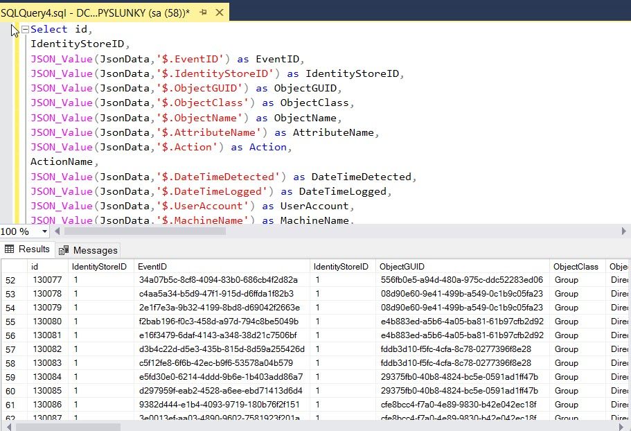

# Retrieve the History Corresponding to a Specific Timestamp from the SQL Database in v10

## Overview

This article explains how to retrieve a list of all modifications made by **Netwrix Directory Manager** (formerly **GroupID**) between January 1, 2024, and December 31, 2024, by running a SQL query against the Directory Manager database. This process allows you to view historical changes for auditing or troubleshooting purposes.

## Instructions

### Retrieve History for a Specific Date Range Using SQL

1. Open **SQL Management Studio**, right-click the Directory Manager database, and select **New Query**.
2. Paste the following SQL query into the query window:

   ```sql
   Select id,
   IdentityStoreID,
   JSON_Value(JsonData,'$.EventID') as EventID,
   JSON_Value(JsonData,'$.IdentityStoreID') as IdentityStoreID,
   JSON_Value(JsonData,'$.ObjectGUID') as ObjectGUID,
   JSON_Value(JsonData,'$.ObjectClass') as ObjectClass,
   JSON_Value(JsonData,'$.ObjectName') as ObjectName,
   JSON_Value(JsonData,'$.AttributeName') as AttributeName,
   JSON_Value(JsonData,'$.Action') as Action,
   ActionName,
   JSON_Value(JsonData,'$.DateTimeDetected') as DateTimeDetected,
   JSON_Value(JsonData,'$.DateTimeLogged') as DateTimeLogged,
   JSON_Value(JsonData,'$.UserAccount') as UserAccount,
   JSON_Value(JsonData,'$.MachineName') as MachineName,
   JSON_Value(JsonData,'$.ClientMachineName') as ClientMachineName,
   JSON_Value(JsonData,'$.UserDN') as UserDN,
   JSON_Value(JsonData,'$.UserGUID') as UserGUID,
   JSON_Value(JsonData,'$.NewValue') as NewValue,
   JSON_Value(JsonData,'$.NewValueResolved') as NewValueResolved,
   JSON_Value(JsonData,'$.OldValue') as OldValue,
   JSON_Value(JsonData,'$.OldValueResolved') as OldValueResolved,
   JSON_Value(JsonData,'$.NewMembers') as NewMembers,
   JSON_Value(JsonData,'$.OldMembers') as OldMembers,
   JSON_Value(JsonData,'$.Comments') as Comments,
   JSON_Value(JsonData,'$.ChangeMadeBy') as ChangeMadeBy,
   SVC.Client.Name,
   JSON_Value(JsonData,'$.RequestedAction') as RequestedAction,
   JSON_Value(JsonData,'$.WorkflowRequester') as WorkflowRequester,
   JSON_Value(JsonData,'$.WorkflowRequesterGUID') as WorkflowRequesterGUID,
   JSON_Query(JsonData,'$.HistoryDetails') as HistoryDetails,
   JSON_Value(JsonData,'$.DisplayName') as DisplayName,
   JSON_Value(JsonData,'$.HistoryObjectAttributes') as HistoryObjectAttributes,
   JSON_Value(JsonData,'$.DescriptiveData') as DescriptiveData,
   JSON_Value(JsonData,'$.HasDetails') as HasDetails,
   JSON_Value(JsonData,'$.listOfAttributes') as listOfAttributes,
   JSON_Value(JsonData,'$.UserDisplayName') as UserDisplayName,
   JSON_Value(JsonData,'$.TicDateTime') as TicDateTime,
   JSON_Value(JsonData,'$.ClientType') as ClientType,
   JSON_Value(JsonData,'$.NewImageValue') as NewImageValue,
   JSON_Value(JsonData,'$.OldImageValue') as OldImageValue
   from svc.BackUpHistory, Event.Action, SVC.Client
   where ActionID = JSON_Value(JsonData,'$.Action')
     AND Secret = JSON_Value(JsonData,'$.ChangeMadeBy')
     AND cast(JSON_Value(JsonData,'$.DateTimeLogged') as date) BETWEEN '2024-01-1' AND '2024-12-31';
   ```

3. Execute the query to retrieve all history events between January 1, 2024, and December 31, 2024.

