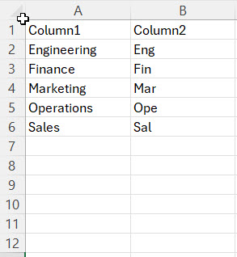
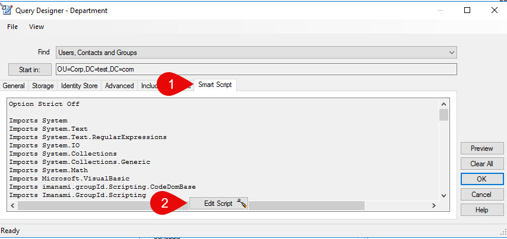
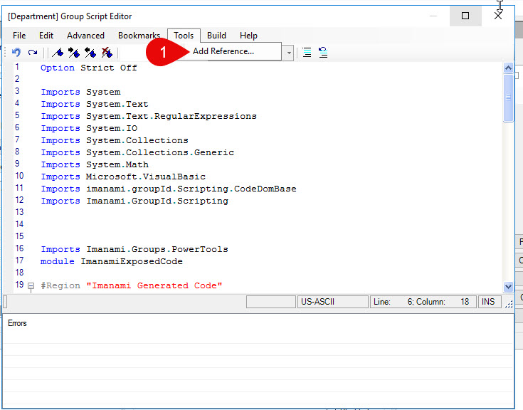
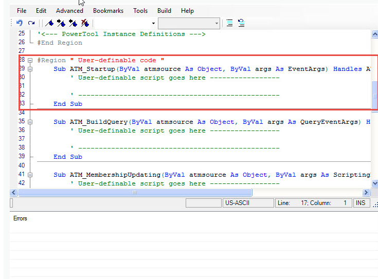
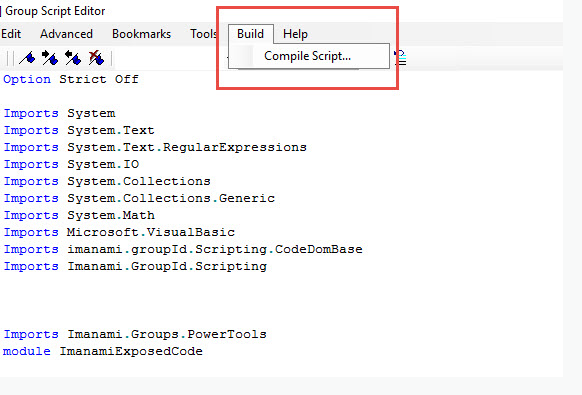
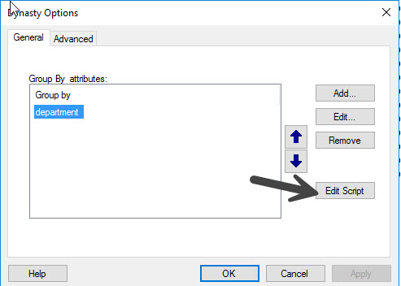
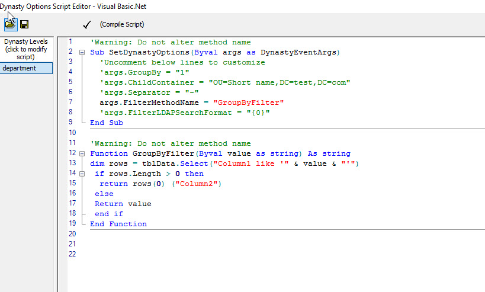
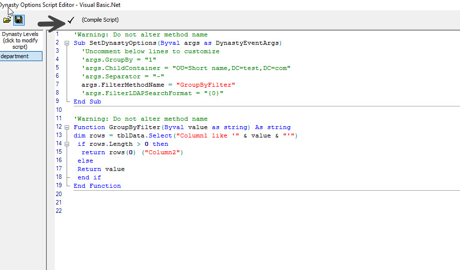

# Shorten the Dynasty Naming Convention for Child Dynasties

## Applies To

Directory Manager 10

## Overview

This article explains how to use a CSV file and custom scripts in **Netwrix Directory Manager** (formerly GroupID) to shorten the naming convention for child dynasties.

## Instructions

1. Create a CSV file with a column for full department names and another column for their corresponding shortened forms.

   

2. Name the columns exactly as `Column1` and `Column2` if there is only one attribute. For multiple attributes, add additional pairs of columns (e.g., `Column3`/`Column4` for job title).

3. Place the CSV file at a convenient location on the Directory Manager server.

4. Create your required dynasty using the dynasty creation wizard. The dynasties will be created with the original attribute values.

5. After creation, open the properties of the parent dynasty and navigate to the **Directory Manager** tab, then click **Modify**.

   

6. In the query designer window, navigate to the **Smart script** tab and click **Edit script**.

   

7. In the Group script editor, click **Tools** and **Add reference**.

   

8. In the Add Reference window, click **Browse** and select **Imanami.Automate.ExcelTool.dll** from `C:\Program Files\Imanami\GroupID 10.0\Automate\PowerTools`.

   

9. Click **Open** and ensure the file appears as selected in the Add Reference window.

   

10. Click **OK**. In the Script editor window, replace the code between line 28 and 33 with the following:

    ```vb
    #Region " User-definable code "
      public tblData = new System.Data.DataTable
      Sub ATM_Startup(ByVal atmsource As Object, ByVal args As EventArgs) Handles ATM.Startup
          ' User-definable script goes here -----------------
          tblData = ExcelTool.ImportWorkSheet("C:\new.csv", 0)
          ' -------------------------------------------------
      End Sub
    ```

    

    > **NOTE:** Replace `C:\new.csv` with the actual path to your CSV file.

11. Click **Compile script** under the Build button at the top. Ensure compilation completes without errors.

    

12. Exit the Script editor and save changes.

13. Click **Preview** in the query designer to verify members.

14. Click **OK** and update the Parent dynasty. Commit changes if prompted.

    

15. To make the CSV file readable for Directory Manager, navigate to the properties of the Parent dynasty and click on the **Directory Manager** tab.

16. Click **Options**. In the options window, click **Edit script**.

    

17. The Dynasty option script editor should open and point to the first group by attribute.

18. Uncomment Line 7 by removing the single quote. Remove the code from line 11 onward and paste the following code:

    ```vb
    'Warning: Do not alter method name
    Function GroupByFilter(Byval value as string) As string
      dim rows = tblData.Select("Column1 like '" & value & "'")
      if rows.Length > 0 then
        return rows(0)("Column2")
      else
        Return value
      end if
    End Function
    ```

    

    > **NOTE:** If you are using multiple group by attributes, update the column names in the code for each attribute as needed. For example, for a title attribute, use `Column5` and `Column6` as appropriate.

19. Click **Compile script** at the top and ensure it compiles without errors.

    

20. Exit the script editor, apply changes, and update the Parent dynasty. The child dynasties should now use the shortened names from the CSV. To add more departments, update the CSV file as needed.

    