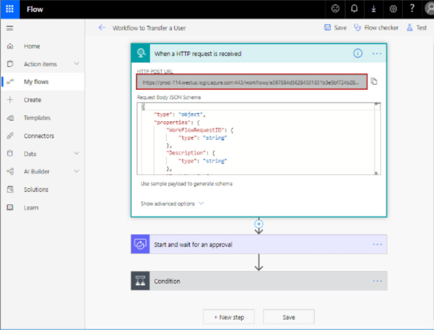

# Triggering Microsoft Flow from Directory Manager Workflows

## Overview

This article explains how to trigger a Microsoft Flow (MS Flow) from Netwrix Directory Manager (formerly GroupID). The goal is to automate user provisioning by linking user creation in Directory Manager to a corresponding SharePoint site access flow based on department information.

By integrating Directory Manager workflows with MS Flow, you ensure that when a user is created and assigned a department, a flow automatically triggers to grant them access to their department’s SharePoint site. When the MS Flow is approved, the linked Directory Manager workflow is also approved automatically.

## Prerequisites

The Directory Manager application in Azure must have the following permissions for MS Flow:

## Instructions

Follow the steps below to link a MS Flow to a Directory Manager Workflow:

1. In Netwrix Directory Manager Management Console, go to the **Identity Stores** node.  
2. Double-click the required identity store to open its properties.  
3. On the **Workflow** tab, click **Microsoft Flow** and configure the following:
   - **Org Code:** The unique name for the MS Flow environment.
   - **Region:** The location of your MS Flow environment.
   - **Directory Manager Server:** The name or IP of your Directory Manager server.
   - **ClientID:** The application ID of the Directory Manager app registered in Azure.
4. Click **OK** to save changes.  
5. Log into the MS Flow portal and open the flow you want to link.  
6. Generate a request URL for the MS Flow.  
   
7. In the Directory Manager Console, go back to the **Workflow** tab of the identity store properties.  
8. Select the workflow to link (e.g., **Create User**) and click **Edit**.  
9. In the **Edit Workflow Route** dialog box, paste the MS Flow request URL into the **Microsoft Flow Request URL** field.  
10. Click **Authenticate** and provide identity store credentials.  
    

> **NOTE:** To quickly define a flow in MS Flow, click **Create Temp** to create a basic template and connect it.

11. Click **OK** to finalize the link between the Directory Manager workflow and MS Flow.

Now, when a user is created in Directory Manager Self-Service and assigned a department, it will trigger the Create User workflow. That workflow will trigger the MS Flow to grant access to the department’s SharePoint site. Approval of the MS Flow will automatically approve the Directory Manager workflow.

## Validation Checklist

- Confirm on the Self-Service portal that the user has been created.  
- Navigate to SharePoint and verify that the user has access to the appropriate department site.
