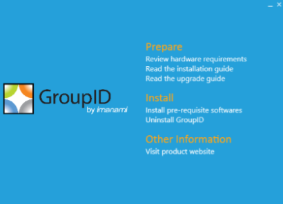

# Uninstall or Fully Remove Directory Manager

## Applies To

Netwrix Directory Manager 9 or above

## Overview

This article explains how to uninstall Netwrix Directory Manager (formerly GroupID) either to upgrade to a newer version or to completely remove all components from a machine.

## Instructions

> **NOTE:** Before you uninstall Netwrix Directory Manager, ensure the logged-in user is a member of the local Administrators group on the machine. Make sure Netwrix Directory Manager is fully closed before you begin the uninstall process.

### Uninstall Directory Manager to Upgrade to a Newer Version

1. Double-click the **`setup.exe`** file in the Directory Manager installation package to launch the installer.  
   
2. Click **Uninstall Directory Manager**. This removes the application files from **Programs & Features** in the **Control Panel**.

### Upgrade to a newer version

1. Click the **Install Directory Manager** link on the installer to install the latest version.  
2. After installation, run the Upgrade wizard to make data from the earlier version compatible with the new version.

### Completely Uninstall Directory Manager from the Machine

1. Click **Uninstall Directory Manager** on the installer to remove the application files from your computer.  
2. Remove the following components to completely uninstall Directory Manager:

- Directory Manager installation directory
- Other relevant directories
- Directory Manager DLLs
- Registry keys
- Services files
- Self-Service and Password Center portal files
- Directory Manager application pool
- Directory Manager certificates

### Remove the Directory Manager Installation Directory

1. Go to `X:\Program Files\Imanami` (where X is the installation drive).  
2. Delete the directory named **GroupID [version]** (for example, GroupID 9.0).

### Remove Other Relevant Directories

1. On the Windows **Run** dialog box, type ` %ALLUSERSPROFILE%\Imanami`.  
2. From the referenced location, delete the GroupID folder.

### Remove Directory Manager DLLs

1. Go to `C:\Windows`.  
2. Search for all DLL files starting with **Imanami** (use `Imanami*.dll` in Windows Explorer).  
3. Delete these files.

### Remove Registry Keys

1. Open the **Registry Editor** by typing `regedit` in the Windows **Run** dialog box.  
2. Delete the following registry keys (for GroupID 9):

- `HKEY_CURRENT_USER\Software\Imanami\GroupID\Version 9.0`
- `HKEY_LOCAL_MACHINE\Software\Imanami\GroupID\Version 9.0`

### Remove Directory Manager Services Files

To remove Directory Manager Data Service and Security Service files:

1. Go to `C:\Windows\Microsoft.NET\Framework64\v4.0.30319\Temporary ASP.NET Files`.  
2. Delete the **groupiddataservice** and **groupidsecurityservice** folders.

### Remove Portal Files

To remove Directory Manager Self-Service and Password Center portal files:

1. Open the Internet Information Services (IIS) console by typing `inetmgr` in the Windows **Run** dialog box.  
2. Under the **GroupIDSite** node, locate the portals created using the Self-Service or Password Center module.  
3. Delete each portal by right-clicking and selecting **Remove**.  
4. After removing the portals, go to `C:\Windows\Microsoft.NET\Framework64\v4.0.30319\Temporary ASP.NET Files`.  
5. Delete each portal folder.

> **NOTE:** If you have installed Password Center Client and want to uninstall it, refer to the Directory Manager Password Center Client Configuration Guide.

### Remove the Directory Manager Application Pool

1. Open the IIS console by typing `inetmgr` in the Windows **Run** dialog box.  
2. Expand the `\<machine name\>` node and click **Application Pools**.  
3. On the Application Pools page, delete **GroupID App Pool**.

### Remove Directory Manager Certificates

1. Open the IIS console by typing `inetmgr` in the Windows **Run** dialog box.  
2. Click the `\<machine name\>` node. On the **Features View** tab, select **Server Certificates** in the **IIS** section.  
3. Delete these certificates bound to **GroupIDSite** (the site deploying Directory Manager Data Service):

- GroupIDSecurityService
- Imanami GroupID Certificate

> **NOTE:** Do not remove these certificates if another Directory Manager version is installed on the machine.
