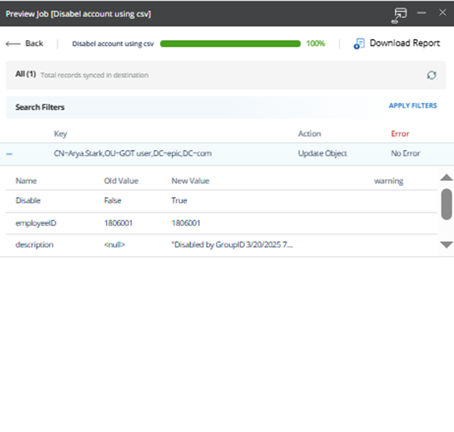

# Use Synchronize to Deprovision User Accounts in Active Directory

## Related Queries

- "Use Directory Manager Synchronize to deprovision user accounts in Active Directory"
- "Is there any way to deprovision user accounts in Active Directory while stamping them with a time and date when they are disabled?"

## Overview

This article explains how to use **Netwrix Directory Manager** (formerly GroupID) **Synchronize** to automatically deprovision user accounts in **Active Directory** when an employee's status is updated to **Termed** in the HR database. The process also stamps the account with the date and time of deprovisioning in the **Description** field for audit and tracking purposes.

## Instructions

1. Open the **Synchronize** portal.
2. In the left pane, click the **Create New** button and select **Job**.
3. On the **Job Template** page, provide job details, select the **Blank Job** option, and click **Next**.
4. Select your source provider, then select **Active Directory** as the destination provider and click **Next**.
5. In the **Sync Object Options** section:
   - Select the required object type (for example, **User**).
   - Select the attribute that will serve as the primary key (for example, **EmployeeID**).
   - Select **Description** and **Disable Account** (pseudo-attribute) as destination fields.

   

6. On the **Map Fields** page, apply the following transformations:
   - Set the destination field for **Description** to **Static** and enter: 
     ```plaintext
     Disabled by GroupID %Now%
     ```
     
   - Set the destination field for **Disable Account** to **Static** and enter: 
     ```plaintext
     True
     ```
     

7. Click **Next**, then use the **Advanced** option to filter user accounts in the HR database where **EmploymentStatus** is 
   ```plaintext
   Termed
   ```

   

   

8. Complete the job wizard, then preview the job to verify the expected results.

   

> **NOTE:** The **Disable Account** pseudo-attribute is available in **Synchronize** and accepts `True` or `False` as values. The `%Now%` variable in the **Description** field will insert the current date and time when the job runs.