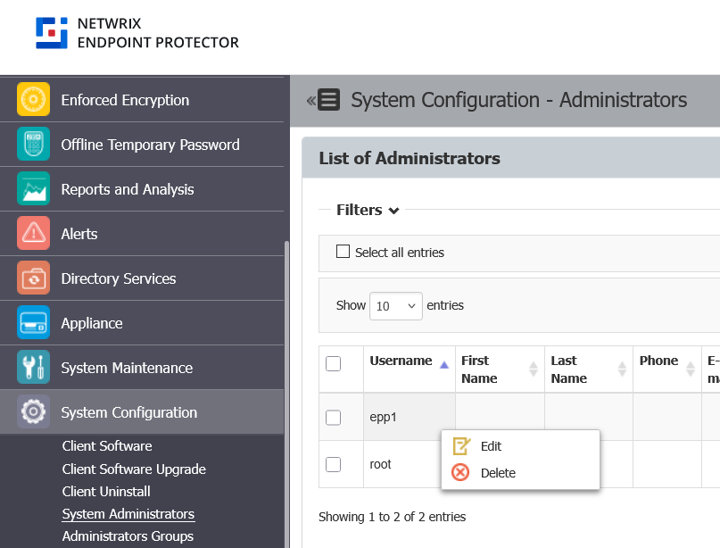

# Enable Two-Factor Authentication for System Admins with Google Authenticator App

## Overview

This article explains how to enable two-factor authentication (2FA) for system administrators with the Google Authenticator App in Endpoint Protector to enhance account security.

## Instructions

1. Navigate to **System Configuration > System Administrators** in Endpoint Protector.
2. Find the system administrator and toggle the switch labeled **Two Factor Authenticator** to **On**.

3. Scan the **QR Code** with the **Google Authenticator app** or enter the provided code into the app to configure the authenticator app.
4. Enter the authentication code from the app into the **Google 2FA Validation** field in Endpoint Protector after importing the account.
5. Click **Validate** and then **Save** the changes for the system administrator.
6. Confirm the changes by locating the **Two-Factor Authentication activated successfully!** notification. The **2FA** column displays **Yes** to verify that the system administrator has two-factor authentication enabled.
7. Log out and log back in with the system administrator account for which you enabled two-factor authentication. After you enter the password, Endpoint Protector prompts for the authentication code before granting access to the server interface.