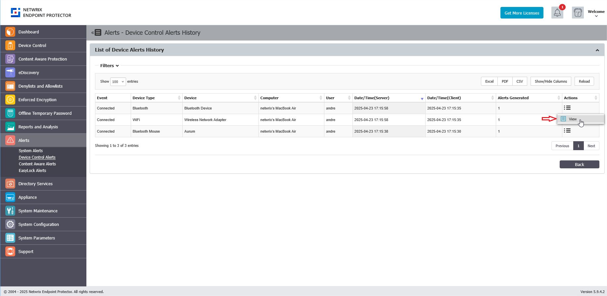
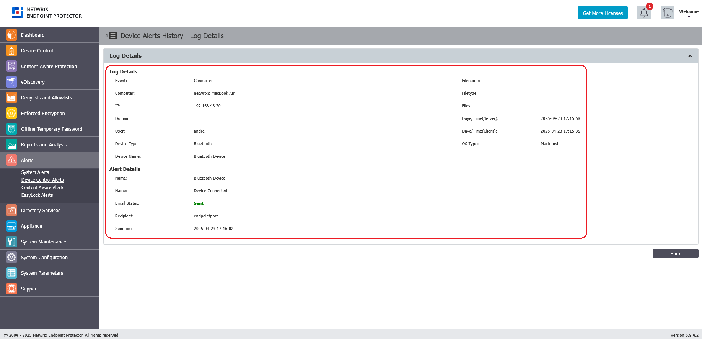

# How to Check the History and Email Status of Alerts

## Overview

This article explains how to check the alert history, log details, and the status of emails generated for specific alerts. You can use these steps to verify whether an email was successfully sent from the Netwrix Endpoint Protector Server.

## Instructions

1. Navigate to the desired alert category, such as **System Alerts**, **Device Control Alerts**, **Content Aware Alerts**, or **EasyLock Alerts**.  
2. Click **View History** to see the list of generated alerts. The alerts are listed under **Alerts History**. Each alert listed in **Alerts History** is also sent via email.  
   
3. In the **Actions** column for the desired alert, click the three-line menu, and then click **View**.  
   
4. The **Log Details** and **Alert Details** will be displayed, along with the **E-mail Status**. Here, you can see if the email was sent successfully from the Netwrix Endpoint Protector Server.  
   
