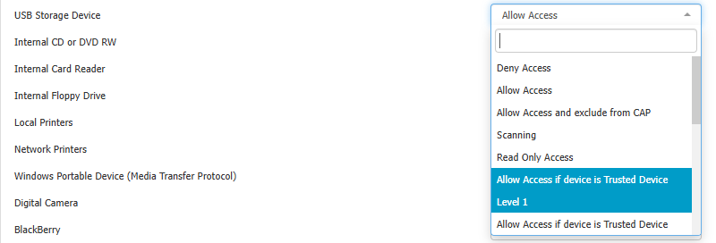

# How EasyLock Software Works with the Endpoint Protector Server and Client Software

## Question

How does the EasyLock software work with the Endpoint Protector (EPP) Server and Client software?

## Answer

EasyLock, when installed on a USB storage device, designates the device as a **Trusted Device Level 1**. The EPP appliance must be configured to recognize this status by enabling the appropriate access right. All file transfers are then managed securely through EasyLock’s vault. If the device is granted general access, it can function as a standard USB device.

Follow the steps below to complete this process:

1. Install EasyLock on a USB storage device.
2. Once EasyLock is installed, the device is turned into a **Trusted Device Level 1 (TD1)**.
3. Configure the EPP appliance with the **Allow Access if device is TD Level 1** setting so that the appliance is made aware of the device status.  
   
4. All file transfers on the device are managed through EasyLock's vault software, ensuring secure data handling.
5. Optional: You can allow regular device usage. If the EasyLock device has the **Allow Access** right, it can be used like a regular device.