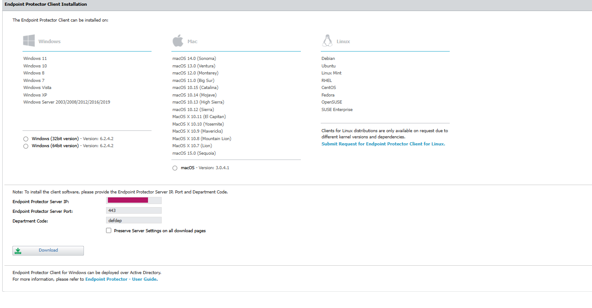

# Network Ports for Netwrix Endpoint Protector Server and Client

## Overview

This article summarizes the network ports used by Netwrix Endpoint Protector Server and Client. Ensuring these ports are open in your firewall is essential for proper communication, updates, and integration with other systems.

> **NOTE:** The port for the user interface and the port for the Netwrix Endpoint Protector client can be separated. To configure this, you must contact Support and request a remote session to make the necessary changes in the backend. Please raise a ticket with [Netwrix Technical Support 🤝](https://www.netwrix.com/support.html).

## Port Usage Details

| Port | Purpose | Direction | Notes |
|------|---------|-----------|-------|
| `443` | HTTPS communication between Netwrix Endpoint Protector Server and Clients | Inbound to Server | Default port for client-server communication. Required for agent deployment and management.  |
| `22` | SSH (Support access) | Inbound to Server | Used by Netwrix Technical Support for remote intervention if required. Should be restricted to trusted sources. |
| `389` | Active Directory integration | Outbound from Server | Default port for LDAP communication with Active Directory. |

## Firewall Configuration

1. Ensure that ports `443`, `22`, and `389` are not blocked by your firewall as required for your deployment.
2. For remote or decentralized environments (e.g., server at a central site, remote employees), configure perimeter firewalls to allow traffic between the Netwrix Endpoint Protector Server and client networks.

## Additional Information

- SSH access (port `22`) should be enabled only when support intervention is required and restricted to trusted sources.
- All communication between Netwrix Endpoint Protector Server and Clients is encrypted over HTTPS (port `443`).
