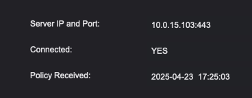

# Update the Endpoint Protector Server IP Address on a Windows Endpoint

## Overview

This article explains how to review and change the Netwrix Endpoint Protector (EPP) server IP address, communication port number, or department code on a Windows endpoint machine without uninstalling and reinstalling the Netwrix Endpoint Protector Client. These steps allow you to redirect communication from an old EPP server to a new one or update connection details as needed.

## Instructions

### Configure Settings via EPP Console

1. Download the Endpoint Protector Set Server IP application:  
   https://download.endpointprotector.com/Support_files/SetServerIP.7z
2. Extract the contents from the `SetServerIP.7z` archive into a new folder.
3. Check the current EPP Client details:
   1. Open the notifier.
   2. Click the **Settings** tab.
   3. Press `ALT + CTRL + I`.  

   The current configuration details will be displayed as shown below.

   

4. Open the folder containing the `SetServerIP` application and run `EppSetServer.exe`.
5. Enter the new EPP server IP address, communication port number, or department code.
6. Click **Update** to apply the new settings.
7. Once a message populates stating the update was successful, restart the Windows endpoint machine for the changes to take effect.
8. Repeat step 3 to confirm that the new details have been applied to the Netwrix Endpoint Protector Client.

### Configure Settings via Script

1. Download the Endpoint Protector Set Server IP application:  
   https://download.endpointprotector.com/Support_files/SetServerIP.7z
2. Extract the contents from the `SetServerIP.7z` archive into a new folder.
3. Create a new note using Windows Notepad and save the file as `EPPSetServer.bat`. You must change the file extension from `.txt` to `.bat`.
4. Edit the batch file in Notepad and insert the following command, updating the details as needed:

```bat
EPPSetServer.exe -ip 192.168.43.113 -port 443 -dept "ITDEP"
```

5. Run the script and then restart the Windows endpoint machine for the new details to be applied.
