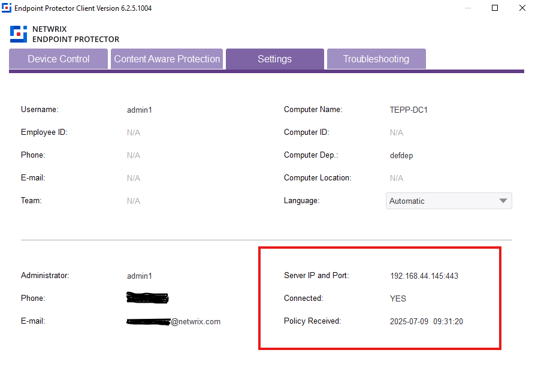

# Upgrade to Client Version 5.9.4.3

## Overview

This article provides instructions for upgrading to Netwrix Endpoint Protector (EPP) client version 5.9.4.3. Follow these procedures to ensure a smooth transition with minimal disruptions.

> **IMPORTANT:** Before starting, capture a snapshot of the Endpoint Protector server.

## Instructions

### Upgrade the Endpoint Protector Server to 5.9.4.2

1. Download the EPP 5.9.4.2 package: [Download Link](https://download.endpointprotector.com/offline_patches/EPP500675942.tar.gz)
2. In the EPP console, navigate to **Dashboard** > **Live Update** > **Offline Patch Uploader**.
3. Select **Choose File** and upload the EPP 5.9.4.2 package.
4. Click **Back** and allow the upgrade to complete.
5. Verify the server displays version 5.9.4.2 in the bottom right corner of the console. Refresh the browser if necessary.

### Download the EPP 5.9.4.3 Client Package

- Access the Netwrix Community to download the required offline patches:
  - **Windows:** [Download Link](https://releases.netwrix.com/products/endpointprotector/625/endpointprotector-client-setup-v6251004.zip)
  - **macOS:** [Download Link](https://releases.netwrix.com/products/endpointprotector/305/endpointprotector-client-mac-setup-v3051005.zip)
  - **New Outlook Add-in:** [Download Link](https://releases.netwrix.com/products/endpointprotector/1.0/endpointprotector-outlook-addin-v1.0.0.0.zip)
  - **Combined Package:** [Download Link](https://releases.netwrix.com/products/endpointprotector/5.9/endpointprotector-mp-hwa-epp4-u0162-m0162-5.9.4.3.tar.gz)

> **NOTE:** For installation instructions for the New Outlook Integration, refer to the [release notes](https://community.netwrix.com/t/version-5-9-4-3-released-now-with-hotfix-1/15972#p-22373-microsoft-new-outlook-full-support-6) or the readme documentation within the download package to configure `manifest_template.xml`.

### Upgrade the Endpoint Protector Client

- Deploy EPP 5.9.4.3 to endpoints manually, via the EPP 5.9.4.2 console, or through your preferred deployment tools.
- Using the EPP 5.9.4.2 console:
  1. Navigate to **Dashboard** > **Live Update** > **Offline Patch Uploader**.
  2. Choose the file for Windows, macOS, or the combined package download.
  3. Complete the installation process and ensure it is successful.

### Verify Installation Success

1. Navigate to **System Configuration** > **Client Software** in the console.
2. Windows should display version 6.2.5.1 and macOS 3.0.5.1.
3. The EPP appliance should show version 5.9.4.2 at the bottom right.

### Configure Client Software Upgrade

1. Go to **System Configuration** > **Client Software Upgrade**.
2. Choose the operating system for agent deployment and select **Next**.
3. Select the relevant group or computer for EPP 5.9.4.3 agent deployment and proceed.
4. Confirm upgrade details, initiate the upgrade job, and allow time for completion.

### Verify Agent Connectivity

- From the client computer:
  1. Open the EPP agent via the system tray icon.
  2. Navigate to **Settings** and press `Ctrl + Alt + i` (Windows) or `Command + Option + i` (macOS).
  
  

- From the EPP server 5.9.4.2 console:
  1. Navigate to **Device Control** > **Computers** > **List of Computers**.
  2. Use filters to locate the computer by name or username and select **Apply**.
  3. Ensure the computer displays the correct client version and status.

### Troubleshooting

- If agents fail to connect, uninstall and reinstall the EPP client software on affected endpoints.
- For discrepancies in computer listings:
  - In **Device Control** > **Global Settings**, increase **Maximum no. of records returned** and **No. of records per page**.
- Verify that all endpoints report accurately and that device control policies are operating correctly.

> **NOTE:** If you encounter client connectivity issues, a clean uninstall and reinstall of the EPP client has resolved such problems previously. Always confirm that you possess the correct upgrade files and follow official upgrade documentation.

## Related Links

- [Version 5.9.4.2 Release Notes](https://community.netwrix.com/t/version-5-9-4-2-released/3466)
- [Version 5.9.4.3 Release Notes](https://community.netwrix.com/t/version-5-9-4-3-released/15972)