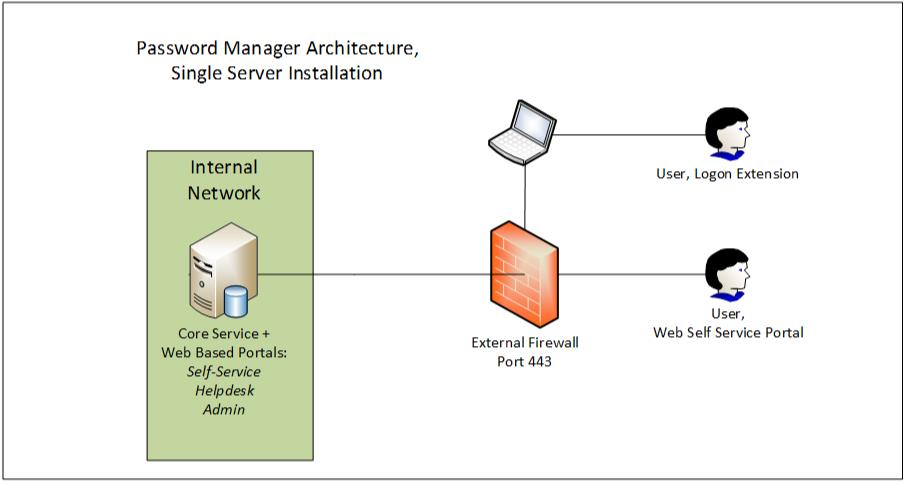
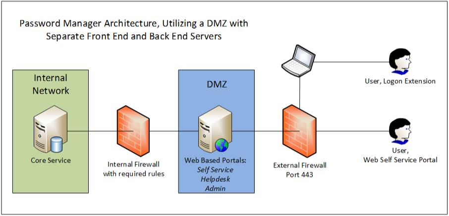
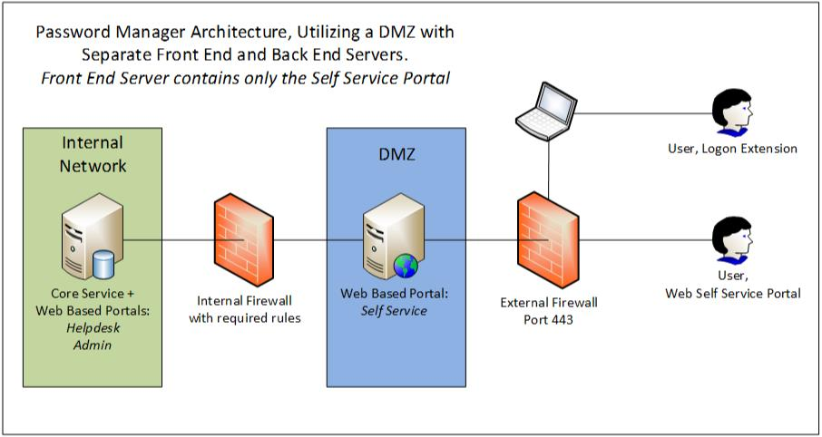
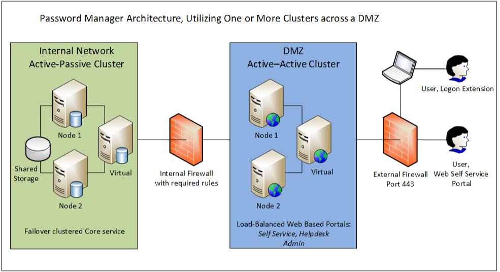

# Common deployment types

There are four ways in which Password Manager can be deployed. Below is a short summary of common deployment types.

1. Single Server Installation — All roles (the service and web-portals) located on a single server deployed internally only or both internally and externally with a NAT through the external firewall. This is the most common and easiest deployment type:  

2. Dual server install, Web roles separate from Core server — The Core Password Manager Service is installed on the internal server (that does not have web portals) and the web portals are installed on a separate server within the DMZ. This allows all web roles to be accessed externally. This deployment scenario is described in detail in the Administrator's guide in paragraph 4.4 page 19:  
http://www.netwrix.com/download/documents/NetWrix_Password_Manager_Administrator_Guide.pdf  

3. Another type of dual server install is full Password Manager installation on the internal server (both the service and web portals) and the Self-service Web portal only installed on the DMZ server. This allows all web roles to be accessed internally and only the Self-service portal to be accessed from outside the network. It is the most secure deployment:  

4. Cluster Install — Cluster of the Front and/or Back End servers. The Front End server can be clustered in an Active/Active role for Load-Balancing and the Back End server can be clustered in an Active/Passive mode only for Failover. Clustering of only Back-end or only Front-end is allowed. It is also possible to cluster a single-server installation. All this can be done by means of built-in Windows features.  

