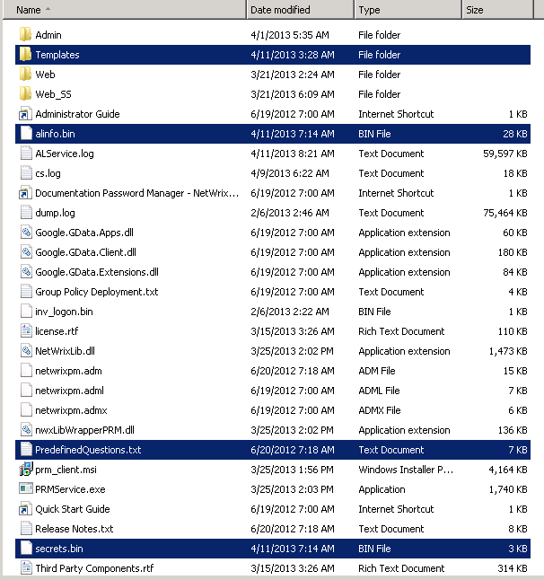
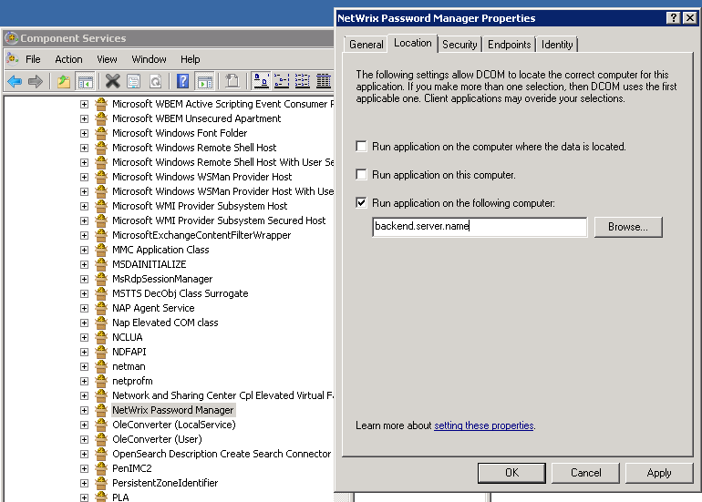

# How to update Password Manager

## What is the procedure to update Netwrix Password Secure?

Prior to upgrade backup the following files from the product installation directory (on backend in case of DMZ setup). This is done for emergency and normally these files will not be required later.

- **alinfo.bin**
- **secrets.bin**
- **Predefined Questions.txt**
- **Templates folder**

### I. Procedure for single server setup

1. Run the installer and follow the instructions of the wizard. All settings will be saved so there is no additional configuration or re-configuration required.

### II. Procedure for DMZ installation

1. Run the installer on the backend server under an account with local admin permissions. Setup will update all product files but will not change any product settings (or IIS settings if it is installed on BE).
2. Run the installer on the frontend server under an account with local admin permissions. Setup will update all product files, including `PRMService.exe` (this file will be recreated if you removed it previously).
3. Make sure the Netwrix Password Secure service is still disabled on the frontend server.
4. Navigate to the product installation directory and rename `PRMService.exe` to `PRMService.exe.old`.
5. Run Task Manager and make sure there is no `PRMService.exe` process running on the frontend server.
6. Check that DCOM settings for Netwrix Password Secure didn't change:

   - Run Component Services configuration (**Start - Run** - `dcomcnfg`)
   - Navigate to **Component Services - Computers - My Computer - DCOM Config - Netwrix Password Secure**
   - Right click **Netwrix Password Secure** node and select **Properties**
   - Go to **Location** tab and make sure that **Run application on this computer** checkbox is disabled and **Run application on the following computer** is enabled and points to the backend

**NOTE.** For the update it is possible to use both the Identity Management installer or explicit installer `prm_setup.exe` that you may get from support.

**NOTE.** Though all new versions of the server are backward compatible with older versions of clients, it is recommended to update Netwrix Password Secure clients on workstations as well. It can be done with help of `prm_client.msi` installer that can be either found in the product installation directory or received from support.

**NOTE.** It may be required to restart the Netwrix Password Secure service upon completion of the upgrade.
