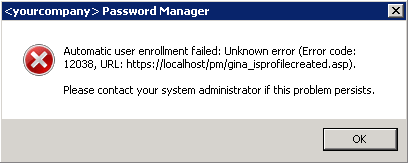
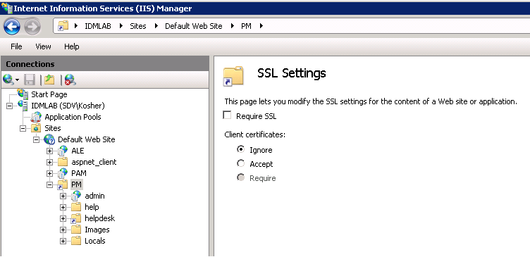

# Automatic enrollment failed: Unknown error

I get the following error in **Enrollment wizard**.  

---

The error occurs when **Enrollment wizard** is not able to connect to the Netwrix Password Reset server. Error code can be different - 12037, 12038, 12029, 12044

It can happen due to several reasons but the most common reasons for this error are an incorrect path to the Netwrix Password Reset Self-Service Portal or incorrect SSL-settings if you are using HTTPS.

---

## To resolve the issue

1. Check that URL of the Netwrix Password Reset Server is specified correctly.  
   The URL of the server is determined by the registry value called `PRM_Server`.  
   There are two registry keys containing this value:
   1. `HKEY_LOCAL_MACHINESOFTWARE[Wow6432Node]PoliciesNetwrixPassword Manager`
   2. `HKEY_LOCAL_MACHINESOFTWARE[Wow6432Node]NetwrixPassword Manager Self-service Client`

   **NOTE.** Wow6432Node for 64-bit OS only

   The key 1 is determined by Group policy. If there is no PRM_Serer value in the key 1, then the value from the key 2 is used.

   Make sure that the specified value has correct URL.  
   

2. Verify SSL settings.
   - Make sure you are able to browse to the Netwrix Password Reset Self-service portal without any warnings. Please refer to [this article](https://kb.netwrix.com/610) if there are warnings.
   - Make sure that SSL settings for PM virtual directory are set to **Ignore client certificates**  
   
