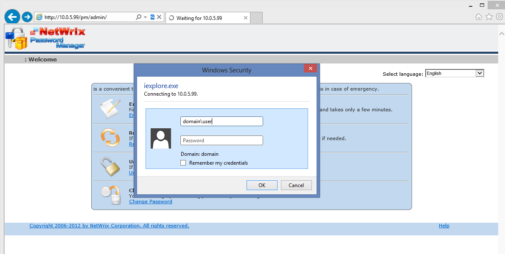
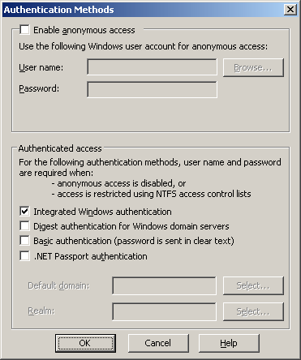
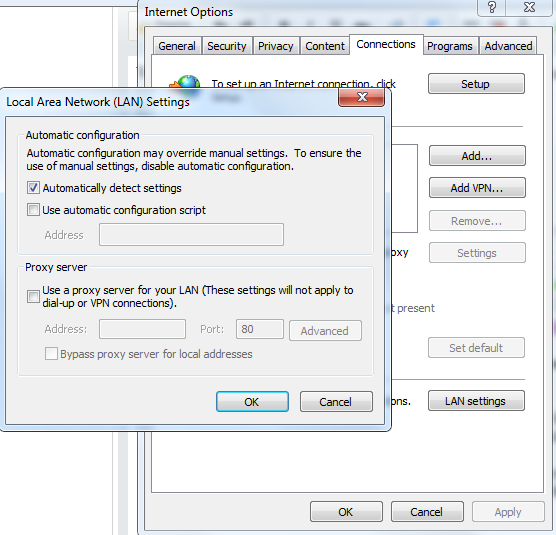

# Cannot login the Helpdesk and Admin portal

When trying to access the Admin or Helpdesk portal, in both cases you receive an IIS login prompt that you are unable to get past.

You have verified that username and password are correct.

---

The portals keep prompting for credentials because the account you are entering cannot be used to authenticate for some reason.

It can happen if, for example:

1. Authentication settings are misconfigured
2. The account does not have read NTFS permissions to the files
3. Proxy is affecting request

There could be other reasons but these are the most common.

---

To resolve the issue please verify the following:

1. It is not because of Loopback authentication. http://support.microsoft.com/kb/896861

2. All authentication types excepting **Windows authentication** or **Basic authentication** are disabled in the **Internet Information Services (IIS) Manager**, and either Windows or Basic authentication is enabled. To ensure the required settings are enabled in **IIS6**, do the following:
   1. In the **IIS Manager** left pane, navigate to the Netwrix Password Reset virtual directory (by default ` <your computer name> -> Web Sites -> Default Web Site -> PM` ).
   2. Right-click the **PM** folder and select **Properties**.
   3. In the **Properties** dialog, open the **Directory Security** tab, and select **Edit** for **Authentication and Access Control**.
   4. In the **Authentication Methods** dialog, select either the **Integrated Windows authentication** box or **Basic authentication** (password is sent in clear text), and clear all other authentication options for Authentication access.

To ensure the required settings are enabled in **IIS7**, do the following:

a) In the **IIS Manager** left pane, navigate to the Netwrix Password Reset virtual directory (by default ` <your computer name> -> Sites -> Default Web Site -> PM` ).

b) In the Manager central pane, double-click the **Authentication** option.

c) In the Authentication list, enable either the **Windows Authentication** option or **Basic Authentication**, and disable all other authentication options.

3. The account you are using has READ access to the physical directory of the Web-portal (by default `C:Program Files (x86)Netwrix Password Manager`).

4. Your proxy server is disabled or bypassed. To check the proxy settings, do the following:
   1. Go to **Control panel -> Internet options**.
   2. In the **Internet Properties** dialog, open the **Connections** tab and click the **LAN settings** button.
   3. Make sure the **Use a proxy server for your LAN** option is not enabled. Otherwise, make sure the **Bypass proxy server for local addresses** option is enabled too; in this case the Help-Desk portal must be a member of the **Local intranet zone**, or specified as an exception.

