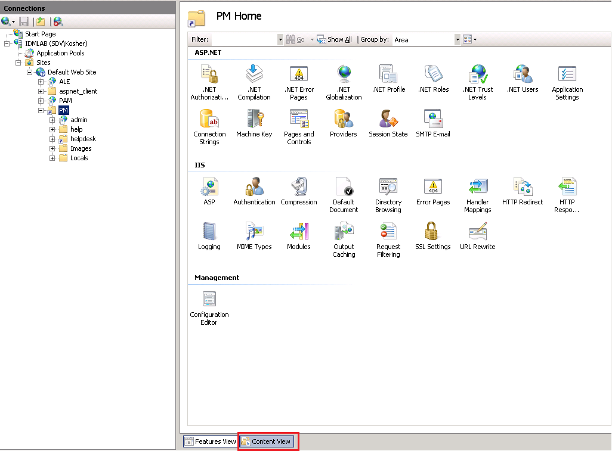

# The enrollment wizard starts every time a user logs in

An enrollment wizard pops up every time a user logs in. After completing the wizard, a message appears confirming that the enrollment procedure has been successful. However, on next login, the wizard pops up again.

In the Netwrix Password Reset administrative console, the user appears as not enrolled into the system.

Such behavior occurs because of authentication issues. Enrollment wizard uses Windows authentication to pass credentials of a user to the Netwrix Password Reset server. The authentication can be configured incorrectly, and because of it another user gets enrolled instead of the correct user.

If you are using single server installation, make sure that the `gina_set_answers.asp` and `gina_set_answers_anonymous.asp` files are configured to use Windows-integrated authentication in the IIS.

## To configure in IIS7

1. Run **IIS Manager** (`inetmgr`)
2. In the left pane, locate the Netwrix Password Reset virtual directory (`PM` by default)
3. Switch to **Content view**
4. Select `gina_set_answers.asp` (or `gina_set_answers_anonymous.asp` respectively) from the list
5. Right-click it and select **Switch to Features view**

6. Select **Authentication** under IIS group
7. Make sure **Windows authentication** is **Enabled** and all other are Disabled

NOTE. For DMZ setup, `gina_set_answers.asp` should have **all** authentication types set to **Disabled**. `gina_set_answers_anonymous.asp` should only have **Windows authentication** set to **Enabled** and all other types of authentication set to **Disabled**.
