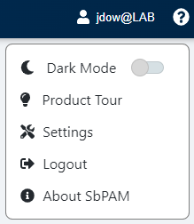
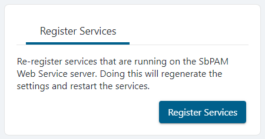

# Renewing the JWT Signing Certificate

## Summary

The following steps should be taken if instructed by Netwrix Support to regenerate Netwrix Privilege Secure's JWT Signing Certificate.

## Instructions

> **IMPORTANT:** While many of these steps use drive letter `C:` in the path, this will differ for Program Files paths if Privilege Secure was installed to a different drive letter. All references to `C:\ProgramData\Stealthbits\PAM` will use drive letter `C:` in all environments.

1. Stop all SbPAM and IIS services by running the following in an elevated PowerShell window:

```powershell
Stop-Service sbpam* -Force
Stop-Service w3svc -Force
```

2. In Windows Explorer, navigate to the Program Data directory for Privilege Secure (for example, `C:\ProgramData\Stealthbits\PAM\`). From here, open the **WebService** folder, and then open `appsettings.jwt.json` in Notepad. In `appsettings.jwt.json`, locate the `"Jwt"` section (such as the example below) and delete all of it. This is the trigger to generate a new JWT Signing Certificate:

```json
"Jwt": {
    "CertificateFile":  "C:\ProgramData\Stealthbits\PAM\Web\jwtsign.pfx",
    "CertificatePassword":  "...",
    "CertificateThumbprint":  "...",
    "Encryptionkey":  "..."
},
```

3. Navigate to `C:\ProgramData\Stealthbits\PAM\Web` and delete the `jwtsign.pfx` file.

4. Navigate back up one level to the PAM folder, and then to the Webservice folder. Open `appsettings.log.json` in Notepad and repeat step #2 if it also has a `"jwt"` section.

5. Run the following commands in an elevated PowerShell window (changing the path to the PAM folder depending on the install path):

```powershell
cd C:\Program Files\Stealthbits\PAM\KeyGen
& .\SbPAM.KeyGen.Exe
```

6. Open `appsettings.jwt.json` again from step #2, and verify the `"Jwt"` section has been recreated.

7. Start all Privilege Secure and IIS services by running the following in an elevated PowerShell window:

```powershell
Start-Service sbpam*
Start-Service w3svc
```

8. Log in to the Privilege Secure web application as an Admin, and re-register services by clicking the logged-in user's name in the upper-right, clicking **Settings**, and then clicking **Register Services**.




